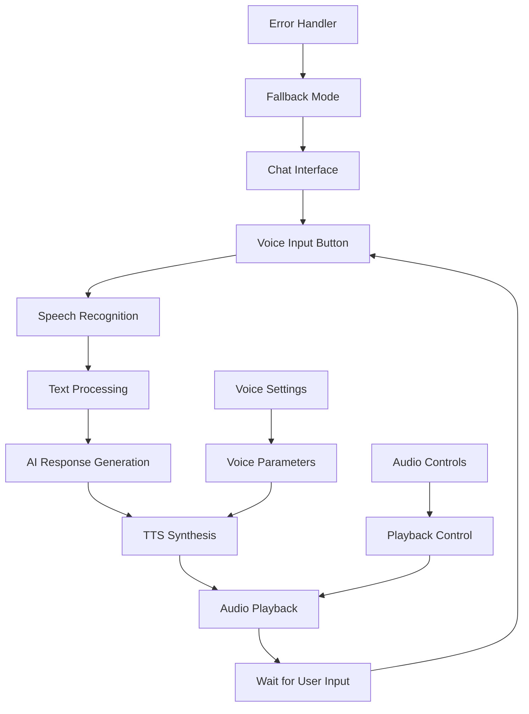
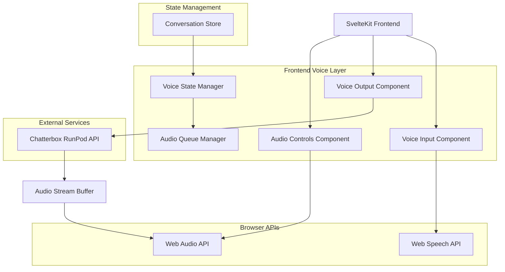

# Chatterbox Voice Agent Integration Documentation

## 1. Product Overview

This document outlines the integration of Chatterbox TTS (Text-to-Speech) model into the existing SvelteKit chat UI to create a live voice agent with natural human-like conversational flow. The integration leverages the serverless Chatterbox endpoint hosted on RunPod to provide real-time voice synthesis capabilities while maintaining seamless voice interaction and realistic dialogue patterns.

## 2. Core Features

### 2.1 Voice Agent Capabilities
- **Real-time Voice Synthesis**: Convert AI responses to natural speech using Chatterbox TTS
- **Voice Input Processing**: Accept user voice input and convert to text for chat processing
- **Emotion Control**: Utilize Chatterbox's unique emotion exaggeration control for expressive speech
- **Voice Customization**: Support for different voice profiles and speaking styles
- **Conversation Flow Management**: Maintain natural dialogue patterns with voice timing
- **Audio Streaming**: Real-time audio playback with minimal latency

### 2.2 Feature Module

Our voice agent integration consists of the following main components:

1. **Voice Input Interface**: Microphone access, speech-to-text conversion, voice activity detection
2. **Voice Output System**: Text-to-speech synthesis, audio playback, queue management
3. **Conversation Manager**: Voice conversation state, turn-taking logic, interruption handling
4. **Audio Controls**: Play/pause controls, volume adjustment, voice settings
5. **Voice Settings Panel**: Voice selection, emotion control, speed adjustment

### 2.3 Integration Details

| Component | Module Name | Feature Description |
|-----------|-------------|--------------------|
| Voice Input Interface | Speech Recognition | Capture user voice input using Web Speech API, convert speech to text, handle voice activity detection and silence detection |
| Voice Output System | TTS Synthesis | Send text to Chatterbox RunPod endpoint, receive audio stream, manage audio playback queue with seamless transitions |
| Conversation Manager | Voice Flow Control | Manage conversation state for voice interactions, handle turn-taking between user and assistant, implement interruption and resume logic |
| Audio Controls | Playback Management | Provide play/pause/stop controls, volume adjustment, audio visualization, progress tracking |
| Voice Settings Panel | Voice Customization | Configure voice parameters (exaggeration, cfg_weight), select voice profiles, adjust speaking speed and tone |
| Error Handling | Fallback System | Handle network failures, audio device issues, TTS service errors with graceful degradation to text-only mode |

## 3. Core Process

### 3.1 Voice Conversation Flow

**User Voice Input Process:**
1. User clicks voice input button to start recording
2. Web Speech API captures audio and converts to text
3. Text is processed through existing chat message pipeline
4. AI generates response text through current conversation system
5. Response text is sent to Chatterbox TTS endpoint
6. Generated audio is streamed back and played to user
7. System waits for next user input or voice command

**Voice Agent Response Process:**
1. AI response text is received from conversation system
2. Text is preprocessed for optimal TTS (emotion markers, pauses)
3. Request sent to Chatterbox RunPod endpoint with voice parameters
4. Audio stream received and buffered for smooth playback
5. Audio plays while maintaining conversation context
6. System monitors for user interruptions during playback

### 3.2 Page Navigation Flow



## 4. Technical Architecture

### 4.1 Architecture Design



### 4.2 Technology Stack

- **Frontend**: SvelteKit@2 + TypeScript + TailwindCSS + Vite
- **Voice Input**: Web Speech API (SpeechRecognition)
- **Voice Output**: Chatterbox TTS via RunPod serverless endpoint
- **Audio Processing**: Web Audio API for playback and effects
- **State Management**: Svelte stores for voice conversation state
- **HTTP Client**: Fetch API for TTS endpoint communication
- **Audio Streaming**: ReadableStream for real-time audio delivery

### 4.3 API Integration

#### 4.3.1 Chatterbox TTS Endpoint

**Voice Synthesis Request**
```
POST https://api.runpod.ai/v2/{endpoint_id}/runsync
```

Request Headers:
| Header | Value | Description |
|--------|-------|-------------|
| Authorization | Bearer {api_key} | RunPod API authentication |
| Content-Type | application/json | Request content type |

Request Body:
| Param Name | Param Type | isRequired | Description |
|------------|------------|------------|-------------|
| input.text | string | true | Text to synthesize |
| input.audio_prompt_path | string | false | Reference audio for voice cloning |
| input.exaggeration | number | false | Emotion intensity (0.0-1.0, default: 0.5) |
| input.cfg_weight | number | false | Configuration weight (0.0-1.0, default: 0.5) |
| input.speed | number | false | Speaking speed multiplier (default: 1.0) |

Response:
| Param Name | Param Type | Description |
|------------|------------|-------------|
| status | string | Request status (COMPLETED/FAILED) |
| output.audio_url | string | URL to generated audio file |
| output.duration | number | Audio duration in seconds |
| executionTime | number | Processing time in milliseconds |

Example Request:
```json
{
  "input": {
    "text": "Hello! I'm your AI assistant. How can I help you today?",
    "exaggeration": 0.6,
    "cfg_weight": 0.4,
    "speed": 1.0
  }
}
```

#### 4.3.2 Voice State Management API

**Voice Conversation State**
```typescript
interface VoiceConversationState {
  isListening: boolean;
  isSpeaking: boolean;
  isProcessing: boolean;
  currentAudioUrl?: string;
  audioQueue: AudioQueueItem[];
  voiceSettings: VoiceSettings;
  errorState?: VoiceError;
}

interface VoiceSettings {
  voiceProfile?: string;
  exaggeration: number;
  cfgWeight: number;
  speed: number;
  volume: number;
}

interface AudioQueueItem {
  id: string;
  text: string;
  audioUrl: string;
  duration: number;
  messageId: string;
}
```

## 5. Data Model Extensions

### 5.1 Voice Message Extensions

```typescript
// Extension to existing Message type
interface VoiceMessage extends Message {
  voice?: {
    audioUrl?: string;
    duration?: number;
    voiceSettings?: VoiceSettings;
    synthesisTime?: number;
    isPlaying?: boolean;
  };
}

// Voice conversation metadata
interface VoiceConversationMeta {
  voiceEnabled: boolean;
  defaultVoiceSettings: VoiceSettings;
  totalAudioDuration: number;
  voiceInteractions: number;
}
```

### 5.2 Database Schema Extensions

```sql
-- Add voice-related columns to messages table
ALTER TABLE messages ADD COLUMN voice_audio_url TEXT;
ALTER TABLE messages ADD COLUMN voice_duration DECIMAL;
ALTER TABLE messages ADD COLUMN voice_settings JSONB;

-- Add voice settings to conversations table
ALTER TABLE conversations ADD COLUMN voice_enabled BOOLEAN DEFAULT false;
ALTER TABLE conversations ADD COLUMN voice_settings JSONB;

-- Add voice preferences to user settings
ALTER TABLE user_settings ADD COLUMN voice_preferences JSONB;

-- Create voice audio cache table
CREATE TABLE voice_audio_cache (
    id UUID PRIMARY KEY DEFAULT gen_random_uuid(),
    text_hash VARCHAR(64) UNIQUE NOT NULL,
    audio_url TEXT NOT NULL,
    voice_settings JSONB NOT NULL,
    duration DECIMAL NOT NULL,
    created_at TIMESTAMP WITH TIME ZONE DEFAULT NOW(),
    expires_at TIMESTAMP WITH TIME ZONE DEFAULT NOW() + INTERVAL '7 days'
);

-- Create index for efficient cache lookups
CREATE INDEX idx_voice_audio_cache_text_hash ON voice_audio_cache(text_hash);
CREATE INDEX idx_voice_audio_cache_expires_at ON voice_audio_cache(expires_at);
```

## 6. Implementation Plan

### 6.1 Phase 1: Core Voice Infrastructure (Week 1-2)

1. **Setup Chatterbox TTS Integration**
   - Create TTS service client for RunPod endpoint
   - Implement audio streaming and caching
   - Add error handling and retry logic

2. **Voice Input Implementation**
   - Integrate Web Speech API for speech recognition
   - Create voice input component with recording controls
   - Implement voice activity detection

3. **Basic Voice Output**
   - Create TTS synthesis component
   - Implement audio playback with Web Audio API
   - Add basic audio controls (play/pause/stop)

### 6.2 Phase 2: Advanced Voice Features (Week 3-4)

1. **Voice Settings and Customization**
   - Create voice settings panel component
   - Implement emotion and speed controls
   - Add voice profile selection

2. **Conversation Flow Management**
   - Implement voice conversation state management
   - Add turn-taking logic and interruption handling
   - Create audio queue management system

3. **Performance Optimization**
   - Implement audio caching strategy
   - Add preloading for common responses
   - Optimize for low-latency interactions

### 6.3 Phase 3: Integration and Polish (Week 5-6)

1. **UI/UX Integration**
   - Integrate voice components into existing chat interface
   - Add visual feedback for voice states
   - Implement responsive design for voice controls

2. **Error Handling and Fallbacks**
   - Add comprehensive error handling
   - Implement graceful degradation to text-only mode
   - Add network connectivity monitoring

3. **Testing and Optimization**
   - Conduct voice interaction testing
   - Optimize for different devices and browsers
   - Performance testing and monitoring

## 7. Component Implementation Details

### 7.1 Voice Input Component

```typescript
// VoiceInput.svelte
interface VoiceInputProps {
  onTranscript: (text: string) => void;
  onError: (error: VoiceError) => void;
  disabled?: boolean;
}

class VoiceInputManager {
  private recognition: SpeechRecognition;
  private isListening: boolean = false;
  
  startListening(): void;
  stopListening(): void;
  handleSpeechResult(event: SpeechRecognitionEvent): void;
  handleSpeechError(event: SpeechRecognitionErrorEvent): void;
}
```

### 7.2 Voice Output Component

```typescript
// VoiceOutput.svelte
interface VoiceOutputProps {
  text: string;
  voiceSettings: VoiceSettings;
  onAudioReady: (audioUrl: string) => void;
  onPlaybackComplete: () => void;
}

class TTSManager {
  private audioContext: AudioContext;
  private audioQueue: AudioQueueItem[];
  
  synthesizeText(text: string, settings: VoiceSettings): Promise<string>;
  playAudio(audioUrl: string): Promise<void>;
  pauseAudio(): void;
  resumeAudio(): void;
  clearQueue(): void;
}
```

### 7.3 Voice Settings Component

```typescript
// VoiceSettings.svelte
interface VoiceSettingsProps {
  settings: VoiceSettings;
  onSettingsChange: (settings: VoiceSettings) => void;
}

const voiceProfiles = [
  { id: 'default', name: 'Default Voice', description: 'Balanced and natural' },
  { id: 'expressive', name: 'Expressive', description: 'More emotional and dynamic' },
  { id: 'calm', name: 'Calm', description: 'Slower and more relaxed' }
];
```

## 8. Error Handling and Fallbacks

### 8.1 Error Types and Handling

```typescript
interface VoiceError {
  type: 'network' | 'audio' | 'speech_recognition' | 'tts_service' | 'browser_support';
  message: string;
  recoverable: boolean;
  fallbackAction?: string;
}

class VoiceErrorHandler {
  handleError(error: VoiceError): void {
    switch (error.type) {
      case 'network':
        // Retry with exponential backoff
        this.retryWithBackoff();
        break;
      case 'audio':
        // Fall back to text-only mode
        this.enableTextOnlyMode();
        break;
      case 'speech_recognition':
        // Show manual text input
        this.showTextInput();
        break;
      case 'tts_service':
        // Use browser TTS as fallback
        this.useBrowserTTS();
        break;
      case 'browser_support':
        // Disable voice features
        this.disableVoiceFeatures();
        break;
    }
  }
}
```

### 8.2 Fallback Strategies

1. **TTS Service Failure**: Fall back to browser's built-in Speech Synthesis API
2. **Network Issues**: Implement retry logic with exponential backoff
3. **Audio Device Issues**: Gracefully degrade to text-only mode
4. **Browser Compatibility**: Detect and disable unsupported features
5. **Speech Recognition Failure**: Provide manual text input option

## 9. Performance Optimization

### 9.1 Audio Caching Strategy

```typescript
class AudioCacheManager {
  private cache: Map<string, CachedAudio> = new Map();
  private maxCacheSize: number = 50; // MB
  
  async getCachedAudio(textHash: string): Promise<string | null>;
  async cacheAudio(textHash: string, audioUrl: string, duration: number): Promise<void>;
  clearExpiredCache(): void;
  optimizeCacheSize(): void;
}

interface CachedAudio {
  audioUrl: string;
  duration: number;
  timestamp: number;
  accessCount: number;
}
```

### 9.2 Preloading Strategy

1. **Common Responses**: Preload frequently used assistant responses
2. **Greeting Messages**: Cache welcome and greeting audio
3. **Error Messages**: Preload common error response audio
4. **Predictive Loading**: Preload likely next responses based on conversation context

### 9.3 Latency Optimization

1. **Streaming Audio**: Implement progressive audio loading
2. **Parallel Processing**: Process TTS while user is still speaking
3. **Connection Pooling**: Maintain persistent connections to RunPod endpoint
4. **Edge Caching**: Utilize CDN for frequently accessed audio files

## 10. Security and Privacy Considerations

### 10.1 Audio Data Handling

1. **Voice Input**: Process speech recognition locally when possible
2. **Audio Storage**: Implement secure temporary storage for generated audio
3. **Data Retention**: Automatic cleanup of cached audio files
4. **User Consent**: Clear permissions for microphone access

### 10.2 API Security

1. **API Key Management**: Secure storage of RunPod API credentials
2. **Rate Limiting**: Implement client-side rate limiting for TTS requests
3. **Request Validation**: Validate and sanitize text before TTS synthesis
4. **Error Information**: Avoid exposing sensitive error details to users

## 11. Testing Strategy

### 11.1 Unit Testing

1. **TTS Service Client**: Test API integration and error handling
2. **Audio Management**: Test playback, queuing, and caching logic
3. **Voice Input**: Test speech recognition and text processing
4. **State Management**: Test voice conversation state transitions

### 11.2 Integration Testing

1. **End-to-End Voice Flow**: Test complete voice conversation cycles
2. **Error Recovery**: Test fallback mechanisms and error handling
3. **Performance**: Test audio latency and quality under various conditions
4. **Browser Compatibility**: Test across different browsers and devices

### 11.3 User Acceptance Testing

1. **Voice Quality**: Evaluate naturalness and clarity of generated speech
2. **Conversation Flow**: Test turn-taking and interruption handling
3. **Usability**: Evaluate ease of use for voice controls and settings
4. **Accessibility**: Test with assistive technologies and accessibility tools

## 12. Deployment Configuration

### 12.1 Environment Variables

```bash
# Chatterbox TTS Configuration
CHATTERBOX_RUNPOD_ENDPOINT_ID=your_endpoint_id
CHATTERBOX_RUNPOD_API_KEY=your_api_key
CHATTERBOX_DEFAULT_EXAGGERATION=0.5
CHATTERBOX_DEFAULT_CFG_WEIGHT=0.5

# Voice Feature Flags
VOICE_FEATURES_ENABLED=true
VOICE_INPUT_ENABLED=true
VOICE_OUTPUT_ENABLED=true
VOICE_CACHING_ENABLED=true

# Audio Configuration
AUDIO_CACHE_MAX_SIZE_MB=50
AUDIO_CACHE_TTL_HOURS=168
AUDIO_MAX_DURATION_SECONDS=300

# Performance Settings
TTS_REQUEST_TIMEOUT_MS=30000
TTS_RETRY_ATTEMPTS=3
TTS_RETRY_DELAY_MS=1000
```

### 12.2 Docker Configuration Updates

```dockerfile
# Add audio processing dependencies
RUN apt-get update && apt-get install -y \
    ffmpeg \
    libavcodec-extra \
    && rm -rf /var/lib/apt/lists/*

# Add environment variables for voice features
ENV VOICE_FEATURES_ENABLED=true
ENV CHATTERBOX_RUNPOD_ENDPOINT_ID=""
ENV CHATTERBOX_RUNPOD_API_KEY=""
```

### 12.3 Kubernetes Deployment

```yaml
apiVersion: apps/v1
kind: Deployment
metadata:
  name: chat-ui-voice
spec:
  template:
    spec:
      containers:
      - name: chat-ui
        env:
        - name: CHATTERBOX_RUNPOD_ENDPOINT_ID
          valueFrom:
            secretKeyRef:
              name: voice-secrets
              key: runpod-endpoint-id
        - name: CHATTERBOX_RUNPOD_API_KEY
          valueFrom:
            secretKeyRef:
              name: voice-secrets
              key: runpod-api-key
        - name: VOICE_FEATURES_ENABLED
          value: "true"
```

This comprehensive integration plan provides a roadmap for implementing Chatterbox TTS voice agent capabilities into the existing SvelteKit chat UI, ensuring seamless voice interactions while maintaining the current architecture and user experience.