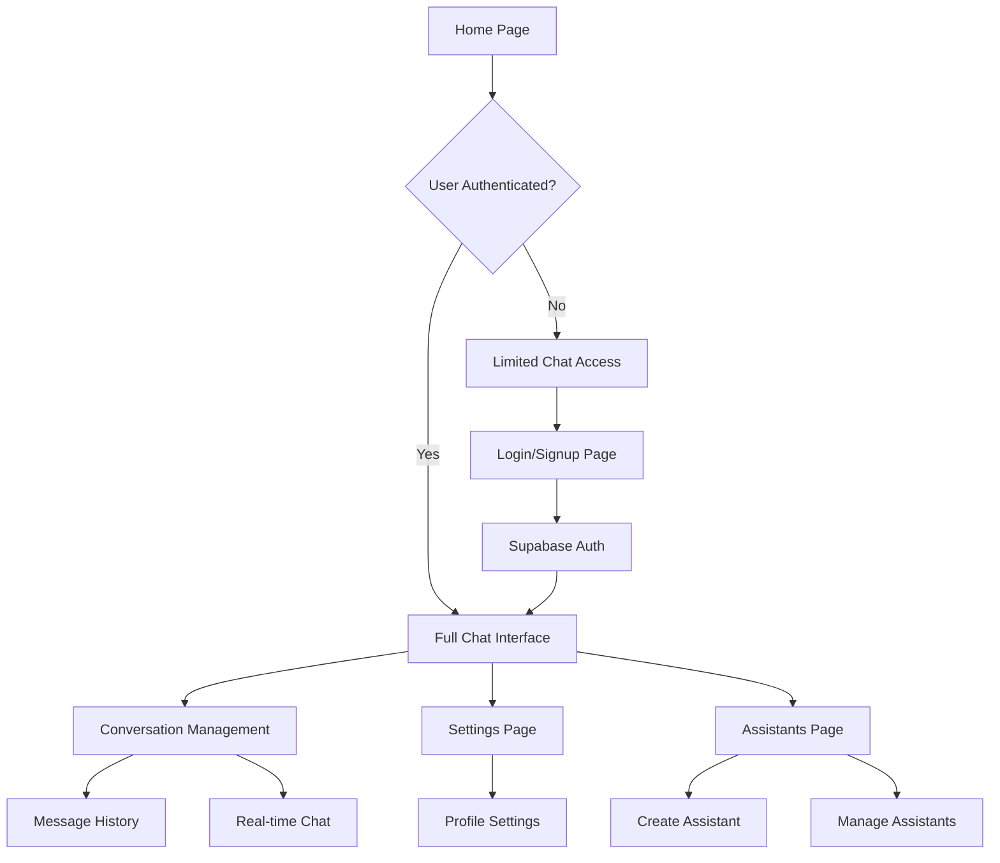

# Docker + Supabase Migration Guide

## 1. Product Overview

This guide provides comprehensive documentation for migrating the Chat UI application from MongoDB to Supabase and configuring it for Docker container deployment. The migration transforms the application from a MongoDB-based architecture to a modern Supabase backend-as-a-service platform, enabling better scalability, built-in authentication, real-time features, and simplified deployment.

The Chat UI application is a SvelteKit-based conversational interface that supports multiple AI models, user authentication, conversation management, and assistant functionality. By migrating to Supabase, we gain access to PostgreSQL database, built-in authentication, real-time subscriptions, and file storage capabilities.

## 2. Core Features

### 2.1 User Roles

| Role | Registration Method | Core Permissions |
|------|---------------------|------------------|
| Anonymous User | No registration required | Can send limited messages before login |
| Authenticated User | Email/OAuth registration via Supabase Auth | Full access to conversations, assistants, settings |
| Admin User | Elevated through admin configuration | User management, system configuration, analytics |

### 2.2 Feature Module

Our migrated Chat UI application consists of the following main pages:

1. **Home page**: conversation interface, model selection, message history
2. **Authentication pages**: login, signup, password reset via Supabase Auth
3. **Settings page**: user preferences, API keys, usage limits
4. **Assistants page**: custom assistant creation and management
5. **Admin dashboard**: user management, system monitoring, configuration

### 2.3 Page Details

| Page Name | Module Name | Feature description |
|-----------|-------------|---------------------|
| Home page | Chat Interface | Real-time message exchange with AI models, conversation history, model switching |
| Home page | Conversation List | Display and manage conversation threads with real-time updates |
| Authentication | Login/Signup | Supabase Auth integration with email, OAuth providers |
| Authentication | Password Reset | Secure password recovery via Supabase Auth |
| Settings | User Preferences | Profile management, API key configuration, usage tracking |
| Settings | Theme & Display | UI customization, language preferences |
| Assistants | Assistant Creation | Custom assistant configuration with RAG capabilities |
| Assistants | Assistant Management | Edit, delete, share custom assistants |
| Admin Dashboard | User Management | View users, manage permissions, usage analytics |
| Admin Dashboard | System Configuration | Model configuration, rate limits, feature flags |

## 3. Core Process

### User Authentication Flow
1. User visits the application
2. If not authenticated, user can send limited messages
3. User signs up/logs in via Supabase Auth (email or OAuth)
4. Authenticated user gains full access to features
5. User sessions are managed by Supabase with automatic token refresh

### Conversation Management Flow
1. User starts a new conversation or selects existing one
2. Messages are stored in Supabase with real-time updates
3. AI responses are generated and stored
4. Conversation history is synchronized across devices
5. Users can share, export, or delete conversations

### Assistant Creation Flow
1. Authenticated user accesses assistant creation
2. User configures assistant parameters and knowledge base
3. Assistant data is stored in Supabase
4. Assistant becomes available for conversations
5. Real-time updates notify other users of new assistants

## 4. User Interface Design

### 4.1 Design Style

- **Primary colors**: Blue (#3B82F6) and Dark Blue (#1E40AF)
- **Secondary colors**: Gray (#6B7280) and Light Gray (#F3F4F6)
- **Button style**: Rounded corners with subtle shadows and hover effects
- **Font**: Inter font family with 14px base size, 16px for headings
- **Layout style**: Clean card-based design with sidebar navigation
- **Icons**: Heroicons and custom SVG icons for consistency
- **Animations**: Smooth transitions and loading states

### 4.2 Page Design Overview

| Page Name | Module Name | UI Elements |
|-----------|-------------|-------------|
| Home page | Chat Interface | Split layout with sidebar for conversations, main area for chat, message bubbles with syntax highlighting |
| Home page | Conversation List | Vertical list with conversation titles, timestamps, and status indicators |
| Authentication | Login Form | Centered card with email/password fields, OAuth buttons, Supabase Auth styling |
| Settings | Preferences Panel | Tabbed interface with form controls, toggle switches, and save indicators |
| Assistants | Assistant Cards | Grid layout with assistant previews, creation button, and management actions |
| Admin Dashboard | Analytics View | Dashboard widgets with charts, user statistics, and system health indicators |

### 4.3 Responsiveness

The application is mobile-first with responsive breakpoints at 768px (tablet) and 1024px (desktop). Touch interactions are optimized for mobile devices with appropriate button sizes and gesture support. The sidebar collapses to a hamburger menu on mobile devices.

## 5. Migration Benefits

### From MongoDB to Supabase
- **Built-in Authentication**: Eliminates custom auth implementation
- **Real-time Features**: Native WebSocket support for live updates
- **PostgreSQL Power**: Advanced querying and data integrity
- **File Storage**: Integrated storage for user uploads and assets
- **Row Level Security**: Database-level security policies
- **Auto-generated APIs**: RESTful and GraphQL APIs out of the box

### Docker Integration
- **Simplified Deployment**: Single container with all dependencies
- **Environment Isolation**: Consistent runtime across environments
- **Scalability**: Easy horizontal scaling with container orchestration
- **Development Parity**: Identical local and production environments
- **Security**: Isolated runtime with minimal attack surface

## 6. Next Steps

After reviewing this migration guide, proceed to:
1. **Technical Architecture Document**: Detailed system design and database schema
2. **Implementation Plan**: Step-by-step migration process
3. **Docker Configuration**: Updated containerization setup
4. **Deployment Guide**: Production deployment instructions

This migration will modernize the Chat UI application with improved performance, security, and developer experience while maintaining all existing functionality.