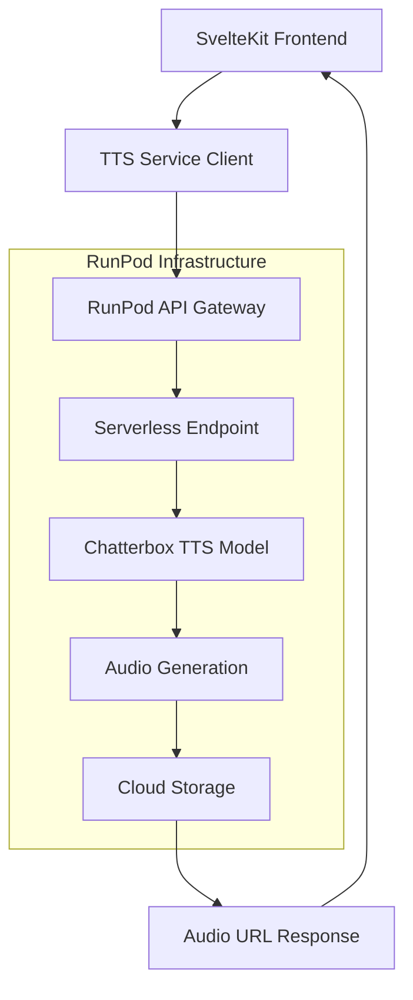

# RunPod API Integration Guide

## 1. Overview

This guide provides comprehensive documentation for integrating the Chatterbox TTS model hosted on RunPod serverless endpoints into the SvelteKit chat UI. It covers API authentication, request handling, error management, and optimization strategies.

## 2. RunPod Serverless Architecture

### 2.1 Endpoint Structure



### 2.2 API Endpoints

| Endpoint Type | URL Pattern | Purpose |
|---------------|-------------|----------|
| Sync Run | `https://api.runpod.ai/v2/{endpoint_id}/runsync` | Synchronous TTS generation |
| Async Run | `https://api.runpod.ai/v2/{endpoint_id}/run` | Asynchronous TTS generation |
| Status Check | `https://api.runpod.ai/v2/{endpoint_id}/status/{job_id}` | Check async job status |
| Health Check | `https://api.runpod.ai/v2/{endpoint_id}/health` | Endpoint health status |

## 3. Authentication and Configuration

### 3.1 Environment Variables

```bash
# Required RunPod Configuration
CHATTERBOX_RUNPOD_ENDPOINT_ID=your_endpoint_id_here
CHATTERBOX_RUNPOD_API_KEY=your_api_key_here
CHATTERBOX_BASE_URL=https://api.runpod.ai/v2

# Optional Configuration
CHATTERBOX_TIMEOUT_MS=30000
CHATTERBOX_MAX_RETRIES=3
CHATTERBOX_RETRY_DELAY_MS=1000
CHATTERBOX_USE_ASYNC=false

# Rate Limiting
CHATTERBOX_RATE_LIMIT_RPM=60
CHATTERBOX_RATE_LIMIT_BURST=10

# Caching
CHATTERBOX_CACHE_ENABLED=true
CHATTERBOX_CACHE_TTL_HOURS=24
CHATTERBOX_CACHE_MAX_SIZE_MB=100
```

### 3.2 API Key Management

```typescript
// src/lib/config/runpod.ts
import { browser } from '$app/environment';

export interface RunPodConfig {
  endpointId: string;
  apiKey: string;
  baseUrl: string;
  timeout: number;
  maxRetries: number;
  retryDelay: number;
  useAsync: boolean;
  rateLimitRpm: number;
  rateLimitBurst: number;
}

class RunPodConfigManager {
  private config: RunPodConfig | null = null;
  
  getConfig(): RunPodConfig {
    if (!this.config) {
      this.config = this.loadConfig();
    }
    return this.config;
  }
  
  private loadConfig(): RunPodConfig {
    // In production, these should be loaded securely
    const endpointId = this.getEnvVar('CHATTERBOX_RUNPOD_ENDPOINT_ID');
    const apiKey = this.getEnvVar('CHATTERBOX_RUNPOD_API_KEY');
    
    if (!endpointId || !apiKey) {
      throw new Error('RunPod configuration missing. Please set CHATTERBOX_RUNPOD_ENDPOINT_ID and CHATTERBOX_RUNPOD_API_KEY');
    }
    
    return {
      endpointId,
      apiKey,
      baseUrl: this.getEnvVar('CHATTERBOX_BASE_URL', 'https://api.runpod.ai/v2'),
      timeout: parseInt(this.getEnvVar('CHATTERBOX_TIMEOUT_MS', '30000')),
      maxRetries: parseInt(this.getEnvVar('CHATTERBOX_MAX_RETRIES', '3')),
      retryDelay: parseInt(this.getEnvVar('CHATTERBOX_RETRY_DELAY_MS', '1000')),
      useAsync: this.getEnvVar('CHATTERBOX_USE_ASYNC', 'false') === 'true',
      rateLimitRpm: parseInt(this.getEnvVar('CHATTERBOX_RATE_LIMIT_RPM', '60')),
      rateLimitBurst: parseInt(this.getEnvVar('CHATTERBOX_RATE_LIMIT_BURST', '10'))
    };
  }
  
  private getEnvVar(key: string, defaultValue?: string): string {
    if (browser) {
      // Client-side: use Vite environment variables
      return import.meta.env[`VITE_${key}`] || defaultValue || '';
    } else {
      // Server-side: use process environment
      return process.env[key] || defaultValue || '';
    }
  }
  
  validateConfig(): boolean {
    try {
      const config = this.getConfig();
      return !!(config.endpointId && config.apiKey && config.baseUrl);
    } catch (error) {
      return false;
    }
  }
}

export const runPodConfig = new RunPodConfigManager();
```

## 4. Enhanced TTS Service Implementation

### 4.1 Advanced ChatterboxTTSService

```typescript
// src/lib/services/ChatterboxTTSService.ts
import type { TTSRequest, TTSResponse, VoiceSettings } from '$lib/types/Voice';
import { runPodConfig } from '$lib/config/runpod';
import { RateLimiter } from '$lib/utils/RateLimiter';
import { AudioCache } from '$lib/utils/AudioCache';
import { browser } from '$app/environment';

export interface RunPodJobResponse {
  id: string;
  status: 'IN_QUEUE' | 'IN_PROGRESS' | 'COMPLETED' | 'FAILED' | 'CANCELLED' | 'TIMED_OUT';
  output?: {
    audio_url: string;
    duration: number;
    sample_rate?: number;
    format?: string;
  };
  error?: string;
  executionTime?: number;
  delayTime?: number;
}

export class ChatterboxTTSService {
  private config = runPodConfig.getConfig();
  private rateLimiter: RateLimiter;
  private audioCache: AudioCache;
  private activeRequests = new Map<string, AbortController>();
  
  constructor() {
    this.rateLimiter = new RateLimiter({
      requestsPerMinute: this.config.rateLimitRpm,
      burstLimit: this.config.rateLimitBurst
    });
    
    this.audioCache = new AudioCache({
      maxSizeMB: parseInt(import.meta.env.VITE_CHATTERBOX_CACHE_MAX_SIZE_MB || '100'),
      ttlHours: parseInt(import.meta.env.VITE_CHATTERBOX_CACHE_TTL_HOURS || '24')
    });
  }
  
  async synthesizeText(request: TTSRequest): Promise<TTSResponse> {
    if (!browser) {
      throw new Error('TTS service can only be used in browser environment');
    }
    
    // Check cache first
    const cacheKey = this.generateCacheKey(request);
    const cached = await this.audioCache.get(cacheKey);
    if (cached) {
      return {
        status: 'COMPLETED',
        output: cached
      };
    }
    
    // Apply rate limiting
    await this.rateLimiter.waitForSlot();
    
    // Choose sync or async based on configuration
    if (this.config.useAsync) {
      return this.synthesizeAsync(request, cacheKey);
    } else {
      return this.synthesizeSync(request, cacheKey);
    }
  }
  
  private async synthesizeSync(request: TTSRequest, cacheKey: string): Promise<TTSResponse> {
    const { text, voiceSettings, messageId } = request;
    
    const payload = {
      input: {
        text: this.preprocessText(text),
        exaggeration: voiceSettings.exaggeration,
        cfg_weight: voiceSettings.cfgWeight,
        speed: voiceSettings.speed,
        ...(voiceSettings.voiceProfile && { audio_prompt_path: voiceSettings.voiceProfile }),
        // Additional Chatterbox-specific parameters
        temperature: 0.7,
        top_p: 0.9,
        repetition_penalty: 1.1,
        max_length: 1000
      }
    };
    
    const controller = new AbortController();
    this.activeRequests.set(messageId, controller);
    
    try {
      const response = await this.makeRequest(
        `${this.config.baseUrl}/${this.config.endpointId}/runsync`,
        payload,
        controller.signal
      );
      
      if (response.status === 'COMPLETED' && response.output) {
        // Cache the result
        await this.audioCache.set(cacheKey, response.output);
        return response;
      } else if (response.status === 'FAILED') {
        throw new Error(response.error || 'TTS synthesis failed');
      } else {
        throw new Error('Unexpected response status: ' + response.status);
      }
      
    } finally {
      this.activeRequests.delete(messageId);
    }
  }
  
  private async synthesizeAsync(request: TTSRequest, cacheKey: string): Promise<TTSResponse> {
    const { text, voiceSettings, messageId } = request;
    
    const payload = {
      input: {
        text: this.preprocessText(text),
        exaggeration: voiceSettings.exaggeration,
        cfg_weight: voiceSettings.cfgWeight,
        speed: voiceSettings.speed,
        ...(voiceSettings.voiceProfile && { audio_prompt_path: voiceSettings.voiceProfile })
      }
    };
    
    // Start async job
    const jobResponse = await this.makeRequest(
      `${this.config.baseUrl}/${this.config.endpointId}/run`,
      payload
    );
    
    if (!jobResponse.id) {
      throw new Error('Failed to start async job');
    }
    
    // Poll for completion
    return this.pollJobStatus(jobResponse.id, cacheKey, messageId);
  }
  
  private async pollJobStatus(
    jobId: string, 
    cacheKey: string, 
    messageId: string
  ): Promise<TTSResponse> {
    const maxPolls = 60; // 5 minutes with 5-second intervals
    const pollInterval = 5000;
    
    for (let i = 0; i < maxPolls; i++) {
      try {
        const status = await this.checkJobStatus(jobId);
        
        if (status.status === 'COMPLETED' && status.output) {
          await this.audioCache.set(cacheKey, status.output);
          return {
            status: 'COMPLETED',
            output: status.output,
            executionTime: status.executionTime
          };
        } else if (status.status === 'FAILED') {
          throw new Error(status.error || 'Async job failed');
        } else if (['CANCELLED', 'TIMED_OUT'].includes(status.status)) {
          throw new Error(`Job ${status.status.toLowerCase()}`);
        }
        
        // Wait before next poll
        await this.delay(pollInterval);
        
      } catch (error) {
        if (i === maxPolls - 1) {
          throw error;
        }
        await this.delay(pollInterval);
      }
    }
    
    throw new Error('Job polling timeout');
  }
  
  private async checkJobStatus(jobId: string): Promise<RunPodJobResponse> {
    const response = await fetch(
      `${this.config.baseUrl}/${this.config.endpointId}/status/${jobId}`,
      {
        headers: {
          'Authorization': `Bearer ${this.config.apiKey}`,
          'Content-Type': 'application/json'
        }
      }
    );
    
    if (!response.ok) {
      throw new Error(`Status check failed: ${response.status} ${response.statusText}`);
    }
    
    return response.json();
  }
  
  private async makeRequest(
    url: string, 
    payload: any, 
    signal?: AbortSignal
  ): Promise<RunPodJobResponse> {
    const controller = new AbortController();
    const timeoutId = setTimeout(() => controller.abort(), this.config.timeout);
    
    // Combine signals if provided
    if (signal) {
      signal.addEventListener('abort', () => controller.abort());
    }
    
    try {
      const response = await fetch(url, {
        method: 'POST',
        headers: {
          'Authorization': `Bearer ${this.config.apiKey}`,
          'Content-Type': 'application/json',
          'User-Agent': 'Chatterbox-SvelteKit/1.0'
        },
        body: JSON.stringify(payload),
        signal: controller.signal
      });
      
      clearTimeout(timeoutId);
      
      if (!response.ok) {
        const errorText = await response.text();
        throw new Error(`HTTP ${response.status}: ${errorText}`);
      }
      
      return await response.json();
      
    } catch (error) {
      clearTimeout(timeoutId);
      
      if (error.name === 'AbortError') {
        throw new Error('Request timeout or cancelled');
      }
      
      throw error;
    }
  }
  
  private preprocessText(text: string): string {
    return text
      .replace(/\*\*(.*?)\*\*/g, '$1') // Remove bold markdown
      .replace(/\*(.*?)\*/g, '$1') // Remove italic markdown
      .replace(/`(.*?)`/g, '$1') // Remove code markdown
      .replace(/\[([^\]]+)\]\([^)]+\)/g, '$1') // Remove links, keep text
      .replace(/#{1,6}\s/g, '') // Remove headers
      .replace(/\n{2,}/g, '. ') // Replace multiple newlines with periods
      .replace(/\n/g, ' ') // Replace single newlines with spaces
      .replace(/\s+/g, ' ') // Normalize whitespace
      .trim()
      .substring(0, 1000); // Limit length
  }
  
  private generateCacheKey(request: TTSRequest): string {
    const { text, voiceSettings } = request;
    const key = JSON.stringify({
      text: this.preprocessText(text),
      settings: voiceSettings
    });
    
    // Generate hash for cache key
    return this.simpleHash(key);
  }
  
  private simpleHash(str: string): string {
    let hash = 0;
    for (let i = 0; i < str.length; i++) {
      const char = str.charCodeAt(i);
      hash = ((hash << 5) - hash) + char;
      hash = hash & hash; // Convert to 32-bit integer
    }
    return Math.abs(hash).toString(36);
  }
  
  private delay(ms: number): Promise<void> {
    return new Promise(resolve => setTimeout(resolve, ms));
  }
  
  // Cancel active request
  cancelRequest(messageId: string): void {
    const controller = this.activeRequests.get(messageId);
    if (controller) {
      controller.abort();
      this.activeRequests.delete(messageId);
    }
  }
  
  // Test connection to the TTS service
  async testConnection(): Promise<boolean> {
    try {
      const response = await fetch(
        `${this.config.baseUrl}/${this.config.endpointId}/health`,
        {
          headers: {
            'Authorization': `Bearer ${this.config.apiKey}`
          }
        }
      );
      
      return response.ok;
    } catch (error) {
      console.error('TTS connection test failed:', error);
      return false;
    }
  }
  
  // Get service statistics
  getStats(): {
    activeRequests: number;
    cacheSize: number;
    rateLimitStatus: any;
  } {
    return {
      activeRequests: this.activeRequests.size,
      cacheSize: this.audioCache.getSize(),
      rateLimitStatus: this.rateLimiter.getStatus()
    };
  }
  
  // Cleanup method
  destroy(): void {
    // Cancel all active requests
    for (const [messageId, controller] of this.activeRequests) {
      controller.abort();
    }
    this.activeRequests.clear();
    
    // Clear cache
    this.audioCache.clear();
  }
}

export const ttsService = new ChatterboxTTSService();
```

## 5. Utility Classes

### 5.1 Rate Limiter

```typescript
// src/lib/utils/RateLimiter.ts
export interface RateLimiterConfig {
  requestsPerMinute: number;
  burstLimit: number;
}

export class RateLimiter {
  private requests: number[] = [];
  private config: RateLimiterConfig;
  private waitQueue: Array<() => void> = [];
  
  constructor(config: RateLimiterConfig) {
    this.config = config;
  }
  
  async waitForSlot(): Promise<void> {
    return new Promise((resolve) => {
      if (this.canMakeRequest()) {
        this.recordRequest();
        resolve();
      } else {
        this.waitQueue.push(() => {
          this.recordRequest();
          resolve();
        });
        this.scheduleNextSlot();
      }
    });
  }
  
  private canMakeRequest(): boolean {
    this.cleanOldRequests();
    return this.requests.length < this.config.burstLimit;
  }
  
  private recordRequest(): void {
    this.requests.push(Date.now());
  }
  
  private cleanOldRequests(): void {
    const oneMinuteAgo = Date.now() - 60000;
    this.requests = this.requests.filter(time => time > oneMinuteAgo);
  }
  
  private scheduleNextSlot(): void {
    if (this.waitQueue.length === 0) return;
    
    const oldestRequest = Math.min(...this.requests);
    const nextSlotTime = oldestRequest + 60000;
    const delay = Math.max(0, nextSlotTime - Date.now());
    
    setTimeout(() => {
      const next = this.waitQueue.shift();
      if (next && this.canMakeRequest()) {
        next();
      }
      this.scheduleNextSlot();
    }, delay);
  }
  
  getStatus(): {
    requestsInLastMinute: number;
    queueLength: number;
    canMakeRequest: boolean;
  } {
    this.cleanOldRequests();
    return {
      requestsInLastMinute: this.requests.length,
      queueLength: this.waitQueue.length,
      canMakeRequest: this.canMakeRequest()
    };
  }
}
```

### 5.2 Audio Cache

```typescript
// src/lib/utils/AudioCache.ts
export interface AudioCacheConfig {
  maxSizeMB: number;
  ttlHours: number;
}

export interface CachedAudio {
  audio_url: string;
  duration: number;
  timestamp: number;
  size: number;
}

export class AudioCache {
  private cache = new Map<string, CachedAudio>();
  private config: AudioCacheConfig;
  private currentSize = 0;
  
  constructor(config: AudioCacheConfig) {
    this.config = config;
    this.loadFromStorage();
  }
  
  async get(key: string): Promise<{ audio_url: string; duration: number } | null> {
    const cached = this.cache.get(key);
    
    if (!cached) {
      return null;
    }
    
    // Check if expired
    const maxAge = this.config.ttlHours * 60 * 60 * 1000;
    if (Date.now() - cached.timestamp > maxAge) {
      this.cache.delete(key);
      this.currentSize -= cached.size;
      return null;
    }
    
    return {
      audio_url: cached.audio_url,
      duration: cached.duration
    };
  }
  
  async set(key: string, audio: { audio_url: string; duration: number }): Promise<void> {
    // Estimate size (rough approximation)
    const estimatedSize = audio.duration * 32; // 32KB per second estimate
    
    // Check if we need to make space
    while (this.currentSize + estimatedSize > this.config.maxSizeMB * 1024 * 1024) {
      this.evictOldest();
    }
    
    const cached: CachedAudio = {
      ...audio,
      timestamp: Date.now(),
      size: estimatedSize
    };
    
    this.cache.set(key, cached);
    this.currentSize += estimatedSize;
    
    this.saveToStorage();
  }
  
  private evictOldest(): void {
    let oldestKey: string | null = null;
    let oldestTime = Date.now();
    
    for (const [key, cached] of this.cache) {
      if (cached.timestamp < oldestTime) {
        oldestTime = cached.timestamp;
        oldestKey = key;
      }
    }
    
    if (oldestKey) {
      const cached = this.cache.get(oldestKey)!;
      this.cache.delete(oldestKey);
      this.currentSize -= cached.size;
    }
  }
  
  private loadFromStorage(): void {
    try {
      const stored = localStorage.getItem('audio-cache');
      if (stored) {
        const data = JSON.parse(stored);
        this.cache = new Map(data.entries);
        this.currentSize = data.size;
      }
    } catch (error) {
      console.error('Failed to load audio cache:', error);
    }
  }
  
  private saveToStorage(): void {
    try {
      const data = {
        entries: Array.from(this.cache.entries()),
        size: this.currentSize
      };
      localStorage.setItem('audio-cache', JSON.stringify(data));
    } catch (error) {
      console.error('Failed to save audio cache:', error);
    }
  }
  
  getSize(): number {
    return this.currentSize;
  }
  
  clear(): void {
    this.cache.clear();
    this.currentSize = 0;
    localStorage.removeItem('audio-cache');
  }
}
```

## 6. Error Handling and Recovery

### 6.1 Error Types and Handling

```typescript
// src/lib/types/RunPodErrors.ts
export interface RunPodError {
  type: 'network' | 'authentication' | 'rate_limit' | 'server_error' | 'timeout' | 'invalid_input';
  code: string;
  message: string;
  details?: any;
  recoverable: boolean;
  retryAfter?: number;
}

export class RunPodErrorHandler {
  static handleError(error: any): RunPodError {
    if (error.name === 'AbortError') {
      return {
        type: 'timeout',
        code: 'REQUEST_TIMEOUT',
        message: 'Request timed out',
        recoverable: true
      };
    }
    
    if (error.message?.includes('401')) {
      return {
        type: 'authentication',
        code: 'INVALID_API_KEY',
        message: 'Invalid API key or authentication failed',
        recoverable: false
      };
    }
    
    if (error.message?.includes('429')) {
      return {
        type: 'rate_limit',
        code: 'RATE_LIMIT_EXCEEDED',
        message: 'Rate limit exceeded',
        recoverable: true,
        retryAfter: 60000 // 1 minute
      };
    }
    
    if (error.message?.includes('500') || error.message?.includes('502') || error.message?.includes('503')) {
      return {
        type: 'server_error',
        code: 'SERVER_ERROR',
        message: 'Server error occurred',
        recoverable: true,
        retryAfter: 5000 // 5 seconds
      };
    }
    
    return {
      type: 'network',
      code: 'UNKNOWN_ERROR',
      message: error.message || 'Unknown error occurred',
      recoverable: true
    };
  }
  
  static getRetryStrategy(error: RunPodError, attempt: number): {
    shouldRetry: boolean;
    delay: number;
  } {
    if (!error.recoverable || attempt >= 3) {
      return { shouldRetry: false, delay: 0 };
    }
    
    const baseDelay = error.retryAfter || 1000;
    const exponentialDelay = baseDelay * Math.pow(2, attempt - 1);
    const jitteredDelay = exponentialDelay + Math.random() * 1000;
    
    return {
      shouldRetry: true,
      delay: Math.min(jitteredDelay, 30000) // Max 30 seconds
    };
  }
}
```

## 7. Monitoring and Analytics

### 7.1 Service Monitoring

```typescript
// src/lib/services/TTSMonitoring.ts
export interface TTSMetrics {
  totalRequests: number;
  successfulRequests: number;
  failedRequests: number;
  averageResponseTime: number;
  cacheHitRate: number;
  errorsByType: Record<string, number>;
}

export class TTSMonitoring {
  private metrics: TTSMetrics = {
    totalRequests: 0,
    successfulRequests: 0,
    failedRequests: 0,
    averageResponseTime: 0,
    cacheHitRate: 0,
    errorsByType: {}
  };
  
  private responseTimes: number[] = [];
  private cacheHits = 0;
  private cacheMisses = 0;
  
  recordRequest(startTime: number, success: boolean, fromCache: boolean, errorType?: string): void {
    this.metrics.totalRequests++;
    
    if (success) {
      this.metrics.successfulRequests++;
    } else {
      this.metrics.failedRequests++;
      if (errorType) {
        this.metrics.errorsByType[errorType] = (this.metrics.errorsByType[errorType] || 0) + 1;
      }
    }
    
    if (fromCache) {
      this.cacheHits++;
    } else {
      this.cacheMisses++;
      const responseTime = Date.now() - startTime;
      this.responseTimes.push(responseTime);
      
      // Keep only last 100 response times
      if (this.responseTimes.length > 100) {
        this.responseTimes.shift();
      }
    }
    
    this.updateAverages();
  }
  
  private updateAverages(): void {
    if (this.responseTimes.length > 0) {
      this.metrics.averageResponseTime = 
        this.responseTimes.reduce((sum, time) => sum + time, 0) / this.responseTimes.length;
    }
    
    const totalCacheRequests = this.cacheHits + this.cacheMisses;
    if (totalCacheRequests > 0) {
      this.metrics.cacheHitRate = this.cacheHits / totalCacheRequests;
    }
  }
  
  getMetrics(): TTSMetrics {
    return { ...this.metrics };
  }
  
  reset(): void {
    this.metrics = {
      totalRequests: 0,
      successfulRequests: 0,
      failedRequests: 0,
      averageResponseTime: 0,
      cacheHitRate: 0,
      errorsByType: {}
    };
    this.responseTimes = [];
    this.cacheHits = 0;
    this.cacheMisses = 0;
  }
}

export const ttsMonitoring = new TTSMonitoring();
```

## 8. Testing and Validation

### 8.1 Integration Tests

```typescript
// src/lib/services/__tests__/ChatterboxTTSService.test.ts
import { describe, it, expect, vi, beforeEach } from 'vitest';
import { ChatterboxTTSService } from '../ChatterboxTTSService';
import type { TTSRequest } from '$lib/types/Voice';

describe('ChatterboxTTSService', () => {
  let service: ChatterboxTTSService;
  
  beforeEach(() => {
    // Mock environment variables
    vi.stubEnv('VITE_CHATTERBOX_RUNPOD_ENDPOINT_ID', 'test-endpoint');
    vi.stubEnv('VITE_CHATTERBOX_RUNPOD_API_KEY', 'test-key');
    
    service = new ChatterboxTTSService();
  });
  
  it('should synthesize text successfully', async () => {
    const mockResponse = {
      status: 'COMPLETED',
      output: {
        audio_url: 'https://example.com/audio.wav',
        duration: 2.5
      }
    };
    
    global.fetch = vi.fn().mockResolvedValue({
      ok: true,
      json: () => Promise.resolve(mockResponse)
    });
    
    const request: TTSRequest = {
      text: 'Hello world',
      voiceSettings: {
        exaggeration: 0.5,
        cfgWeight: 0.5,
        speed: 1.0,
        volume: 1.0
      },
      messageId: 'test-123'
    };
    
    const response = await service.synthesizeText(request);
    
    expect(response.status).toBe('COMPLETED');
    expect(response.output?.audio_url).toBe('https://example.com/audio.wav');
    expect(response.output?.duration).toBe(2.5);
  });
  
  it('should handle rate limiting', async () => {
    // Test rate limiting behavior
    const requests = Array.from({ length: 15 }, (_, i) => ({
      text: `Test message ${i}`,
      voiceSettings: {
        exaggeration: 0.5,
        cfgWeight: 0.5,
        speed: 1.0,
        volume: 1.0
      },
      messageId: `test-${i}`
    }));
    
    global.fetch = vi.fn().mockResolvedValue({
      ok: true,
      json: () => Promise.resolve({
        status: 'COMPLETED',
        output: { audio_url: 'test.wav', duration: 1 }
      })
    });
    
    const startTime = Date.now();
    await Promise.all(requests.map(req => service.synthesizeText(req)));
    const endTime = Date.now();
    
    // Should take some time due to rate limiting
    expect(endTime - startTime).toBeGreaterThan(1000);
  });
  
  it('should handle errors gracefully', async () => {
    global.fetch = vi.fn().mockRejectedValue(new Error('Network error'));
    
    const request: TTSRequest = {
      text: 'Test',
      voiceSettings: {
        exaggeration: 0.5,
        cfgWeight: 0.5,
        speed: 1.0,
        volume: 1.0
      },
      messageId: 'test-error'
    };
    
    await expect(service.synthesizeText(request)).rejects.toThrow('Network error');
  });
});
```

## 9. Deployment Configuration

### 9.1 Production Environment Setup

```bash
# Production .env
CHATTERBOX_RUNPOD_ENDPOINT_ID=prod_endpoint_id_here
CHATTERBOX_RUNPOD_API_KEY=prod_api_key_here
CHATTERBOX_USE_ASYNC=true
CHATTERBOX_RATE_LIMIT_RPM=120
CHATTERBOX_CACHE_ENABLED=true
CHATTERBOX_CACHE_MAX_SIZE_MB=200
```

### 9.2 Docker Configuration

```dockerfile
# Add to your existing Dockerfile
ENV CHATTERBOX_RUNPOD_ENDPOINT_ID=${CHATTERBOX_RUNPOD_ENDPOINT_ID}
ENV CHATTERBOX_RUNPOD_API_KEY=${CHATTERBOX_RUNPOD_API_KEY}
ENV CHATTERBOX_USE_ASYNC=true
ENV CHATTERBOX_RATE_LIMIT_RPM=120
```

This comprehensive RunPod API integration guide provides everything needed to successfully integrate the Chatterbox TTS model with robust error handling, caching, rate limiting, and monitoring capabilities.