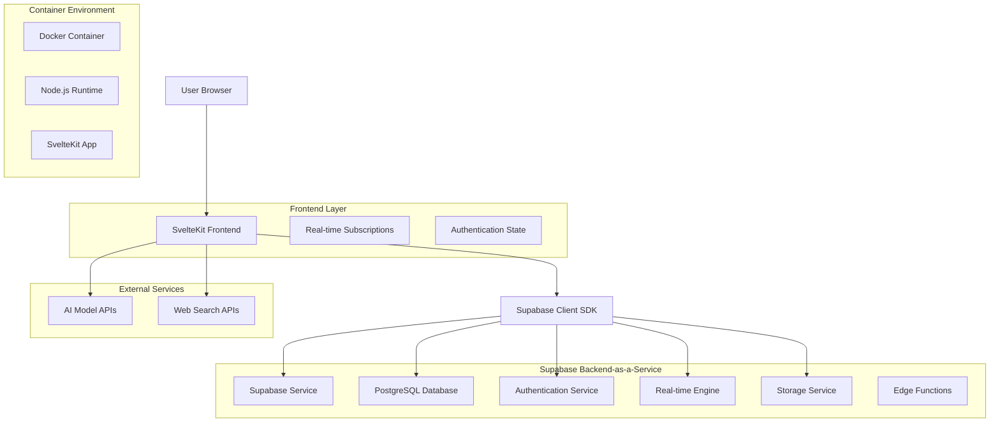
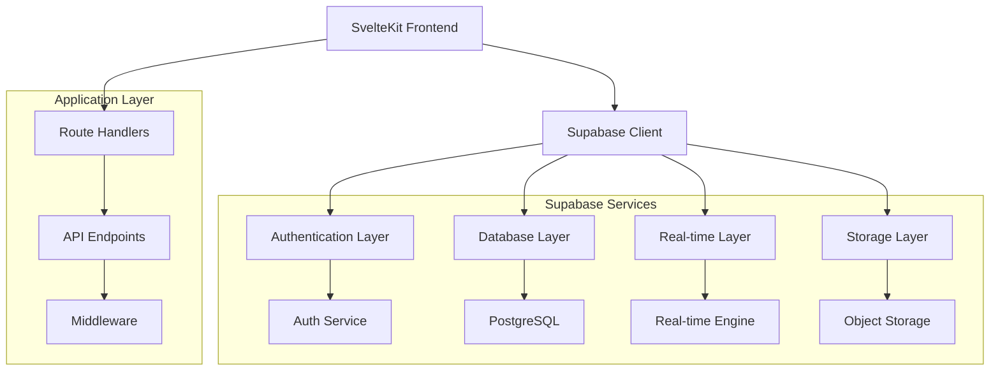
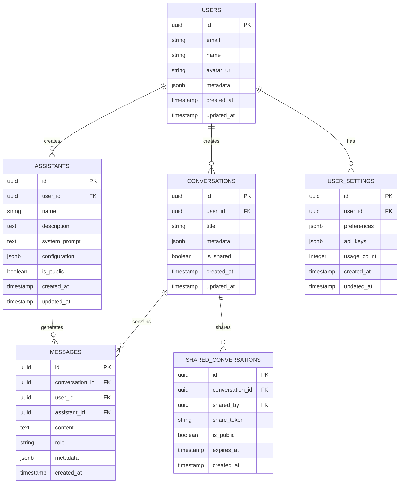

# Technical Architecture Document

## 1. Architecture Design



## 2. Technology Description

- **Frontend**: SvelteKit@2 + TypeScript + TailwindCSS + Vite
- **Backend**: Supabase (PostgreSQL + Auth + Real-time + Storage)
- **Container**: Docker with Node.js 20 runtime
- **Authentication**: Supabase Auth with JWT tokens
- **Database**: PostgreSQL via Supabase with Row Level Security
- **Real-time**: Supabase Real-time subscriptions
- **File Storage**: Supabase Storage for user uploads

## 3. Route Definitions

| Route | Purpose |
|-------|---------|
| / | Home page with chat interface and conversation list |
| /login | Authentication page with Supabase Auth integration |
| /signup | User registration via Supabase Auth |
| /settings | User preferences and configuration |
| /assistants | Custom assistant creation and management |
| /conversation/[id] | Individual conversation view |
| /admin | Admin dashboard for user and system management |
| /api/auth/callback | Supabase Auth callback handler |
| /api/chat | Chat message processing endpoint |
| /api/assistants | Assistant CRUD operations |

## 4. API Definitions

### 4.1 Core API

**Authentication (handled by Supabase Auth)**
```
POST /auth/v1/signup
POST /auth/v1/token
POST /auth/v1/logout
```

**Chat Messages**
```
POST /api/chat
```

Request:
| Param Name | Param Type | isRequired | Description |
|------------|------------|------------|-------------|
| message | string | true | User message content |
| conversation_id | string | false | Existing conversation ID |
| model | string | true | AI model identifier |
| assistant_id | string | false | Custom assistant ID |

Response:
| Param Name | Param Type | Description |
|------------|------------|-------------|
| response | string | AI generated response |
| conversation_id | string | Conversation identifier |
| message_id | string | Message identifier |

**Conversations**
```
GET /rest/v1/conversations
POST /rest/v1/conversations
PATCH /rest/v1/conversations
DELETE /rest/v1/conversations
```

**Assistants**
```
GET /rest/v1/assistants
POST /rest/v1/assistants
PATCH /rest/v1/assistants
DELETE /rest/v1/assistants
```

## 5. Server Architecture Diagram



## 6. Data Model

### 6.1 Data Model Definition



### 6.2 Data Definition Language

**Users Table (managed by Supabase Auth)**
```sql
-- Users table is automatically created by Supabase Auth
-- We extend it with a profiles table
CREATE TABLE profiles (
    id UUID REFERENCES auth.users(id) PRIMARY KEY,
    email VARCHAR(255) NOT NULL,
    name VARCHAR(100),
    avatar_url TEXT,
    metadata JSONB DEFAULT '{}',
    created_at TIMESTAMP WITH TIME ZONE DEFAULT NOW(),
    updated_at TIMESTAMP WITH TIME ZONE DEFAULT NOW()
);

-- Row Level Security
ALTER TABLE profiles ENABLE ROW LEVEL SECURITY;

-- Policies
CREATE POLICY "Users can view own profile" ON profiles
    FOR SELECT USING (auth.uid() = id);

CREATE POLICY "Users can update own profile" ON profiles
    FOR UPDATE USING (auth.uid() = id);

-- Trigger for updated_at
CREATE OR REPLACE FUNCTION update_updated_at_column()
RETURNS TRIGGER AS $$
BEGIN
    NEW.updated_at = NOW();
    RETURN NEW;
END;
$$ language 'plpgsql';

CREATE TRIGGER update_profiles_updated_at
    BEFORE UPDATE ON profiles
    FOR EACH ROW
    EXECUTE FUNCTION update_updated_at_column();
```

**Conversations Table**
```sql
CREATE TABLE conversations (
    id UUID PRIMARY KEY DEFAULT gen_random_uuid(),
    user_id UUID REFERENCES auth.users(id) ON DELETE CASCADE,
    title VARCHAR(255) NOT NULL DEFAULT 'New Conversation',
    metadata JSONB DEFAULT '{}',
    is_shared BOOLEAN DEFAULT FALSE,
    created_at TIMESTAMP WITH TIME ZONE DEFAULT NOW(),
    updated_at TIMESTAMP WITH TIME ZONE DEFAULT NOW()
);

-- Indexes
CREATE INDEX idx_conversations_user_id ON conversations(user_id);
CREATE INDEX idx_conversations_created_at ON conversations(created_at DESC);

-- Row Level Security
ALTER TABLE conversations ENABLE ROW LEVEL SECURITY;

-- Policies
CREATE POLICY "Users can view own conversations" ON conversations
    FOR SELECT USING (auth.uid() = user_id OR is_shared = TRUE);

CREATE POLICY "Users can create conversations" ON conversations
    FOR INSERT WITH CHECK (auth.uid() = user_id);

CREATE POLICY "Users can update own conversations" ON conversations
    FOR UPDATE USING (auth.uid() = user_id);

CREATE POLICY "Users can delete own conversations" ON conversations
    FOR DELETE USING (auth.uid() = user_id);

-- Trigger
CREATE TRIGGER update_conversations_updated_at
    BEFORE UPDATE ON conversations
    FOR EACH ROW
    EXECUTE FUNCTION update_updated_at_column();
```

**Messages Table**
```sql
CREATE TABLE messages (
    id UUID PRIMARY KEY DEFAULT gen_random_uuid(),
    conversation_id UUID REFERENCES conversations(id) ON DELETE CASCADE,
    user_id UUID REFERENCES auth.users(id) ON DELETE CASCADE,
    assistant_id UUID REFERENCES assistants(id) ON DELETE SET NULL,
    content TEXT NOT NULL,
    role VARCHAR(20) NOT NULL CHECK (role IN ('user', 'assistant', 'system')),
    metadata JSONB DEFAULT '{}',
    created_at TIMESTAMP WITH TIME ZONE DEFAULT NOW()
);

-- Indexes
CREATE INDEX idx_messages_conversation_id ON messages(conversation_id);
CREATE INDEX idx_messages_created_at ON messages(created_at);
CREATE INDEX idx_messages_user_id ON messages(user_id);

-- Row Level Security
ALTER TABLE messages ENABLE ROW LEVEL SECURITY;

-- Policies
CREATE POLICY "Users can view messages in their conversations" ON messages
    FOR SELECT USING (
        EXISTS (
            SELECT 1 FROM conversations 
            WHERE conversations.id = messages.conversation_id 
            AND (conversations.user_id = auth.uid() OR conversations.is_shared = TRUE)
        )
    );

CREATE POLICY "Users can create messages in their conversations" ON messages
    FOR INSERT WITH CHECK (
        EXISTS (
            SELECT 1 FROM conversations 
            WHERE conversations.id = messages.conversation_id 
            AND conversations.user_id = auth.uid()
        )
    );
```

**Assistants Table**
```sql
CREATE TABLE assistants (
    id UUID PRIMARY KEY DEFAULT gen_random_uuid(),
    user_id UUID REFERENCES auth.users(id) ON DELETE CASCADE,
    name VARCHAR(100) NOT NULL,
    description TEXT,
    system_prompt TEXT,
    configuration JSONB DEFAULT '{}',
    is_public BOOLEAN DEFAULT FALSE,
    created_at TIMESTAMP WITH TIME ZONE DEFAULT NOW(),
    updated_at TIMESTAMP WITH TIME ZONE DEFAULT NOW()
);

-- Indexes
CREATE INDEX idx_assistants_user_id ON assistants(user_id);
CREATE INDEX idx_assistants_is_public ON assistants(is_public);
CREATE INDEX idx_assistants_created_at ON assistants(created_at DESC);

-- Row Level Security
ALTER TABLE assistants ENABLE ROW LEVEL SECURITY;

-- Policies
CREATE POLICY "Users can view own and public assistants" ON assistants
    FOR SELECT USING (auth.uid() = user_id OR is_public = TRUE);

CREATE POLICY "Users can create assistants" ON assistants
    FOR INSERT WITH CHECK (auth.uid() = user_id);

CREATE POLICY "Users can update own assistants" ON assistants
    FOR UPDATE USING (auth.uid() = user_id);

CREATE POLICY "Users can delete own assistants" ON assistants
    FOR DELETE USING (auth.uid() = user_id);

-- Trigger
CREATE TRIGGER update_assistants_updated_at
    BEFORE UPDATE ON assistants
    FOR EACH ROW
    EXECUTE FUNCTION update_updated_at_column();
```

**User Settings Table**
```sql
CREATE TABLE user_settings (
    id UUID PRIMARY KEY DEFAULT gen_random_uuid(),
    user_id UUID REFERENCES auth.users(id) ON DELETE CASCADE UNIQUE,
    preferences JSONB DEFAULT '{}',
    api_keys JSONB DEFAULT '{}',
    usage_count INTEGER DEFAULT 0,
    created_at TIMESTAMP WITH TIME ZONE DEFAULT NOW(),
    updated_at TIMESTAMP WITH TIME ZONE DEFAULT NOW()
);

-- Indexes
CREATE UNIQUE INDEX idx_user_settings_user_id ON user_settings(user_id);

-- Row Level Security
ALTER TABLE user_settings ENABLE ROW LEVEL SECURITY;

-- Policies
CREATE POLICY "Users can view own settings" ON user_settings
    FOR SELECT USING (auth.uid() = user_id);

CREATE POLICY "Users can update own settings" ON user_settings
    FOR ALL USING (auth.uid() = user_id);

-- Trigger
CREATE TRIGGER update_user_settings_updated_at
    BEFORE UPDATE ON user_settings
    FOR EACH ROW
    EXECUTE FUNCTION update_updated_at_column();
```

**Shared Conversations Table**
```sql
CREATE TABLE shared_conversations (
    id UUID PRIMARY KEY DEFAULT gen_random_uuid(),
    conversation_id UUID REFERENCES conversations(id) ON DELETE CASCADE,
    shared_by UUID REFERENCES auth.users(id) ON DELETE CASCADE,
    share_token VARCHAR(255) UNIQUE NOT NULL DEFAULT encode(gen_random_bytes(32), 'hex'),
    is_public BOOLEAN DEFAULT FALSE,
    expires_at TIMESTAMP WITH TIME ZONE,
    created_at TIMESTAMP WITH TIME ZONE DEFAULT NOW()
);

-- Indexes
CREATE INDEX idx_shared_conversations_token ON shared_conversations(share_token);
CREATE INDEX idx_shared_conversations_conversation_id ON shared_conversations(conversation_id);

-- Row Level Security
ALTER TABLE shared_conversations ENABLE ROW LEVEL SECURITY;

-- Policies
CREATE POLICY "Users can view shared conversations" ON shared_conversations
    FOR SELECT USING (is_public = TRUE OR auth.uid() = shared_by);

CREATE POLICY "Users can create shares for own conversations" ON shared_conversations
    FOR INSERT WITH CHECK (
        EXISTS (
            SELECT 1 FROM conversations 
            WHERE conversations.id = shared_conversations.conversation_id 
            AND conversations.user_id = auth.uid()
        )
    );
```

## 7. Environment Configuration

### Required Environment Variables

```bash
# Supabase Configuration
SUPABASE_URL=https://ybibjftiefxmnznkrojm.supabase.co
SUPABASE_ANON_KEY=eyJhbGciOiJIUzI1NiIsInR5cCI6IkpXVCJ9...
SUPABASE_SERVICE_ROLE_KEY=eyJhbGciOiJIUzI1NiIsInR5cCI6IkpXVCJ9...

# Application Configuration
PUBLIC_SUPABASE_URL=https://ybibjftiefxmnznkrojm.supabase.co
PUBLIC_SUPABASE_ANON_KEY=eyJhbGciOiJIUzI1NiIsInR5cCI6IkpXVCJ9...

# Legacy MongoDB (for migration period)
MONGODB_URL=mongodb://localhost:27017
MONGODB_DB_NAME=chat-ui

# AI Model APIs
OPENAI_API_KEY=your_openai_key
ANTHROPIC_API_KEY=your_anthropic_key
HF_TOKEN=your_huggingface_token

# Application Settings
PUBLIC_APP_NAME=ChatUI
PUBLIC_APP_ASSETS=chatui
COOKIE_NAME=supabase-auth-token
```

## 8. Security Considerations

- **Row Level Security**: All tables use RLS policies for data isolation
- **JWT Authentication**: Supabase handles secure token management
- **API Key Security**: Service role key never exposed to frontend
- **CORS Configuration**: Proper origin restrictions in production
- **Environment Variables**: Sensitive data in secure environment variables
- **Database Policies**: Granular access control at database level