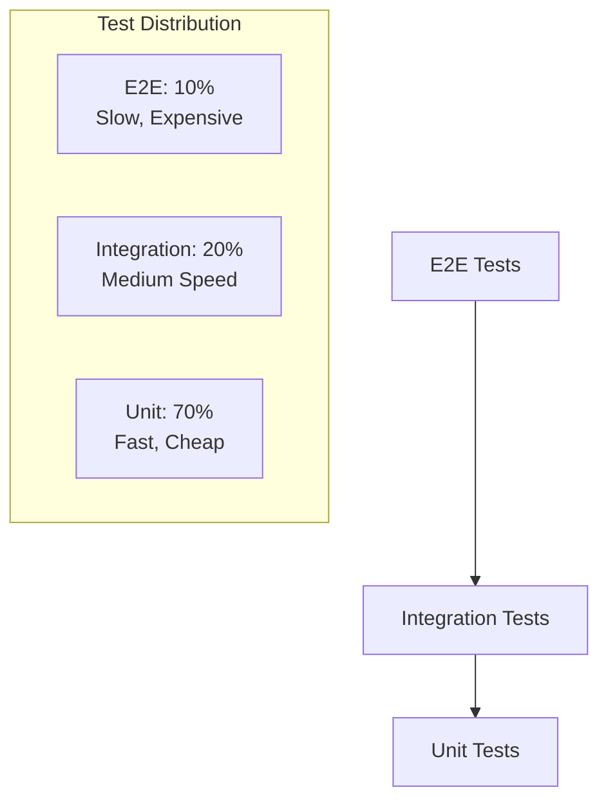

# Voice Agent Testing Strategy

## 1. Overview

This document outlines a comprehensive testing strategy for the Chatterbox TTS voice agent integration, covering unit tests, integration tests, end-to-end tests, performance testing, and accessibility testing.

## 2. Testing Architecture

### 2.1 Testing Pyramid



### 2.2 Test Environment Setup

```typescript
// vitest.config.ts
import { defineConfig } from 'vitest/config';
import { sveltekit } from '@sveltejs/kit/vite';

export default defineConfig({
  plugins: [sveltekit()],
  test: {
    include: ['src/**/*.{test,spec}.{js,ts}'],
    environment: 'jsdom',
    setupFiles: ['src/test/setup.ts'],
    globals: true,
    coverage: {
      reporter: ['text', 'json', 'html'],
      exclude: [
        'node_modules/',
        'src/test/',
        '**/*.d.ts',
        '**/*.config.*'
      ]
    },
    env: {
      CHATTERBOX_RUNPOD_ENDPOINT_ID: 'test-endpoint',
      CHATTERBOX_RUNPOD_API_KEY: 'test-key',
      CHATTERBOX_BASE_URL: 'https://api.runpod.ai/v2'
    }
  }
});
```

```typescript
// src/test/setup.ts
import { vi } from 'vitest';
import { beforeAll, afterEach } from 'vitest';

// Mock Web APIs
Object.defineProperty(window, 'speechSynthesis', {
  writable: true,
  value: {
    speak: vi.fn(),
    cancel: vi.fn(),
    pause: vi.fn(),
    resume: vi.fn(),
    getVoices: vi.fn(() => []),
    speaking: false,
    pending: false,
    paused: false
  }
});

Object.defineProperty(window, 'SpeechRecognition', {
  writable: true,
  value: vi.fn(() => ({
    start: vi.fn(),
    stop: vi.fn(),
    abort: vi.fn(),
    addEventListener: vi.fn(),
    removeEventListener: vi.fn()
  }))
});

Object.defineProperty(window, 'webkitSpeechRecognition', {
  writable: true,
  value: window.SpeechRecognition
});

// Mock Audio API
Object.defineProperty(window, 'Audio', {
  writable: true,
  value: vi.fn(() => ({
    play: vi.fn().mockResolvedValue(undefined),
    pause: vi.fn(),
    load: vi.fn(),
    addEventListener: vi.fn(),
    removeEventListener: vi.fn(),
    currentTime: 0,
    duration: 0,
    volume: 1,
    muted: false,
    paused: true,
    ended: false
  }))
});

// Mock fetch
global.fetch = vi.fn();

// Mock localStorage
Object.defineProperty(window, 'localStorage', {
  value: {
    getItem: vi.fn(),
    setItem: vi.fn(),
    removeItem: vi.fn(),
    clear: vi.fn()
  }
});

beforeAll(() => {
  // Setup global test environment
});

afterEach(() => {
  vi.clearAllMocks();
});
```

## 3. Unit Tests

### 3.1 ChatterboxTTSService Tests

```typescript
// src/lib/services/__tests__/ChatterboxTTSService.test.ts
import { describe, it, expect, vi, beforeEach } from 'vitest';
import { ChatterboxTTSService } from '../ChatterboxTTSService';
import type { TTSRequest, TTSResponse } from '$lib/types/Voice';

describe('ChatterboxTTSService', () => {
  let service: ChatterboxTTSService;
  let mockFetch: ReturnType<typeof vi.fn>;

  beforeEach(() => {
    mockFetch = vi.fn();
    global.fetch = mockFetch;
    service = new ChatterboxTTSService();
  });

  describe('synthesize', () => {
    it('should successfully synthesize text to speech', async () => {
      const mockResponse: TTSResponse = {
        id: 'test-id',
        status: 'COMPLETED',
        output: {
          audio_url: 'https://example.com/audio.wav',
          duration: 5.2
        }
      };

      mockFetch.mockResolvedValueOnce({
        ok: true,
        json: () => Promise.resolve(mockResponse)
      });

      const request: TTSRequest = {
        text: 'Hello, world!',
        voice_settings: {
          exaggeration: 1.2,
          cfg_weight: 0.8,
          speed: 1.0
        }
      };

      const result = await service.synthesize(request);

      expect(result).toEqual(mockResponse);
      expect(mockFetch).toHaveBeenCalledWith(
        expect.stringContaining('/runsync'),
        expect.objectContaining({
          method: 'POST',
          headers: expect.objectContaining({
            'Authorization': expect.stringContaining('Bearer'),
            'Content-Type': 'application/json'
          }),
          body: JSON.stringify({ input: request })
        })
      );
    });

    it('should handle API errors gracefully', async () => {
      mockFetch.mockResolvedValueOnce({
        ok: false,
        status: 500,
        statusText: 'Internal Server Error'
      });

      const request: TTSRequest = {
        text: 'Test text',
        voice_settings: { exaggeration: 1.0, cfg_weight: 0.5, speed: 1.0 }
      };

      await expect(service.synthesize(request)).rejects.toThrow(
        'TTS synthesis failed: 500 Internal Server Error'
      );
    });

    it('should retry failed requests', async () => {
      mockFetch
        .mockResolvedValueOnce({ ok: false, status: 500 })
        .mockResolvedValueOnce({ ok: false, status: 500 })
        .mockResolvedValueOnce({
          ok: true,
          json: () => Promise.resolve({ id: 'success', status: 'COMPLETED' })
        });

      const request: TTSRequest = {
        text: 'Test text',
        voice_settings: { exaggeration: 1.0, cfg_weight: 0.5, speed: 1.0 }
      };

      const result = await service.synthesize(request);

      expect(result.id).toBe('success');
      expect(mockFetch).toHaveBeenCalledTimes(3);
    });

    it('should preprocess text correctly', async () => {
      mockFetch.mockResolvedValueOnce({
        ok: true,
        json: () => Promise.resolve({ id: 'test', status: 'COMPLETED' })
      });

      const request: TTSRequest = {
        text: 'Hello... world!!!   Multiple   spaces.',
        voice_settings: { exaggeration: 1.0, cfg_weight: 0.5, speed: 1.0 }
      };

      await service.synthesize(request);

      const callArgs = mockFetch.mock.calls[0][1];
      const body = JSON.parse(callArgs.body);
      
      expect(body.input.text).toBe('Hello world! Multiple spaces.');
    });
  });

  describe('testConnection', () => {
    it('should return true for successful health check', async () => {
      mockFetch.mockResolvedValueOnce({
        ok: true,
        json: () => Promise.resolve({ status: 'healthy' })
      });

      const result = await service.testConnection();
      expect(result).toBe(true);
    });

    it('should return false for failed health check', async () => {
      mockFetch.mockResolvedValueOnce({ ok: false, status: 500 });

      const result = await service.testConnection();
      expect(result).toBe(false);
    });
  });

  describe('getStats', () => {
    it('should return service statistics', () => {
      const stats = service.getStats();
      
      expect(stats).toHaveProperty('totalRequests');
      expect(stats).toHaveProperty('successfulRequests');
      expect(stats).toHaveProperty('failedRequests');
      expect(stats).toHaveProperty('averageResponseTime');
      expect(stats).toHaveProperty('cacheHitRate');
    });
  });
});
```

### 3.2 AudioManager Tests

```typescript
// src/lib/services/__tests__/AudioManager.test.ts
import { describe, it, expect, vi, beforeEach } from 'vitest';
import { AudioManager } from '../AudioManager';
import type { AudioQueueItem } from '$lib/types/Voice';

describe('AudioManager', () => {
  let audioManager: AudioManager;
  let mockAudio: any;

  beforeEach(() => {
    mockAudio = {
      play: vi.fn().mockResolvedValue(undefined),
      pause: vi.fn(),
      load: vi.fn(),
      addEventListener: vi.fn(),
      removeEventListener: vi.fn(),
      currentTime: 0,
      duration: 0,
      volume: 1,
      muted: false,
      paused: true,
      ended: false
    };

    global.Audio = vi.fn(() => mockAudio);
    audioManager = new AudioManager();
  });

  describe('playAudio', () => {
    it('should play audio successfully', async () => {
      const audioItem: AudioQueueItem = {
        id: 'test-1',
        url: 'https://example.com/audio.wav',
        text: 'Test audio',
        priority: 1
      };

      const promise = audioManager.playAudio(audioItem);
      
      // Simulate audio ended event
      const endedCallback = mockAudio.addEventListener.mock.calls
        .find(call => call[0] === 'ended')?.[1];
      endedCallback?.();

      await promise;

      expect(mockAudio.play).toHaveBeenCalled();
      expect(mockAudio.addEventListener).toHaveBeenCalledWith('ended', expect.any(Function));
    });

    it('should handle audio loading errors', async () => {
      const audioItem: AudioQueueItem = {
        id: 'test-1',
        url: 'invalid-url',
        text: 'Test audio',
        priority: 1
      };

      mockAudio.play.mockRejectedValue(new Error('Failed to load'));

      await expect(audioManager.playAudio(audioItem)).rejects.toThrow('Failed to load');
    });

    it('should respect volume settings', async () => {
      audioManager.setVolume(0.5);

      const audioItem: AudioQueueItem = {
        id: 'test-1',
        url: 'https://example.com/audio.wav',
        text: 'Test audio',
        priority: 1
      };

      audioManager.playAudio(audioItem);

      expect(mockAudio.volume).toBe(0.5);
    });
  });

  describe('queue management', () => {
    it('should add items to queue', () => {
      const audioItem: AudioQueueItem = {
        id: 'test-1',
        url: 'https://example.com/audio.wav',
        text: 'Test audio',
        priority: 1
      };

      audioManager.addToQueue(audioItem);
      
      expect(audioManager.getQueueLength()).toBe(1);
    });

    it('should process queue in priority order', () => {
      const lowPriority: AudioQueueItem = {
        id: 'low',
        url: 'https://example.com/low.wav',
        text: 'Low priority',
        priority: 1
      };

      const highPriority: AudioQueueItem = {
        id: 'high',
        url: 'https://example.com/high.wav',
        text: 'High priority',
        priority: 3
      };

      audioManager.addToQueue(lowPriority);
      audioManager.addToQueue(highPriority);

      const nextItem = audioManager.getNextQueueItem();
      expect(nextItem?.id).toBe('high');
    });

    it('should clear queue', () => {
      const audioItem: AudioQueueItem = {
        id: 'test-1',
        url: 'https://example.com/audio.wav',
        text: 'Test audio',
        priority: 1
      };

      audioManager.addToQueue(audioItem);
      audioManager.clearQueue();
      
      expect(audioManager.getQueueLength()).toBe(0);
    });
  });

  describe('playback control', () => {
    it('should pause playback', () => {
      audioManager.pause();
      expect(mockAudio.pause).toHaveBeenCalled();
    });

    it('should resume playback', async () => {
      audioManager.resume();
      expect(mockAudio.play).toHaveBeenCalled();
    });

    it('should stop playback', () => {
      audioManager.stop();
      expect(mockAudio.pause).toHaveBeenCalled();
      expect(mockAudio.currentTime).toBe(0);
    });
  });
});
```

### 3.3 Voice Store Tests

```typescript
// src/lib/stores/__tests__/voiceStore.test.ts
import { describe, it, expect, vi, beforeEach } from 'vitest';
import { get } from 'svelte/store';
import { voiceStore } from '../voiceStore';
import type { VoiceSettings } from '$lib/types/Voice';

describe('voiceStore', () => {
  beforeEach(() => {
    // Reset store state
    voiceStore.reset();
    vi.clearAllMocks();
  });

  describe('initialization', () => {
    it('should initialize with default state', () => {
      const state = get(voiceStore);
      
      expect(state.isEnabled).toBe(false);
      expect(state.isListening).toBe(false);
      expect(state.isSpeaking).toBe(false);
      expect(state.isProcessing).toBe(false);
      expect(state.settings).toEqual({
        exaggeration: 1.2,
        cfg_weight: 0.8,
        speed: 1.0,
        volume: 0.8
      });
    });

    it('should load settings from localStorage', () => {
      const savedSettings: VoiceSettings = {
        exaggeration: 1.5,
        cfg_weight: 0.9,
        speed: 1.2,
        volume: 0.6
      };

      vi.mocked(localStorage.getItem).mockReturnValue(JSON.stringify(savedSettings));
      
      voiceStore.loadSettings();
      const state = get(voiceStore);
      
      expect(state.settings).toEqual(savedSettings);
    });
  });

  describe('settings management', () => {
    it('should update settings', () => {
      const newSettings: VoiceSettings = {
        exaggeration: 1.8,
        cfg_weight: 0.7,
        speed: 0.9,
        volume: 0.5
      };

      voiceStore.updateSettings(newSettings);
      const state = get(voiceStore);
      
      expect(state.settings).toEqual(newSettings);
      expect(localStorage.setItem).toHaveBeenCalledWith(
        'voice-settings',
        JSON.stringify(newSettings)
      );
    });

    it('should partially update settings', () => {
      voiceStore.updateSettings({ volume: 0.3 });
      const state = get(voiceStore);
      
      expect(state.settings.volume).toBe(0.3);
      expect(state.settings.exaggeration).toBe(1.2); // unchanged
    });
  });

  describe('state management', () => {
    it('should enable voice features', () => {
      voiceStore.setEnabled(true);
      const state = get(voiceStore);
      
      expect(state.isEnabled).toBe(true);
    });

    it('should set listening state', () => {
      voiceStore.setListening(true);
      const state = get(voiceStore);
      
      expect(state.isListening).toBe(true);
    });

    it('should set speaking state', () => {
      voiceStore.setSpeaking(true);
      const state = get(voiceStore);
      
      expect(state.isSpeaking).toBe(true);
    });

    it('should set processing state', () => {
      voiceStore.setProcessing(true);
      const state = get(voiceStore);
      
      expect(state.isProcessing).toBe(true);
    });
  });

  describe('error handling', () => {
    it('should set error state', () => {
      const error = new Error('Test error');
      voiceStore.setError(error);
      const state = get(voiceStore);
      
      expect(state.error).toBe(error);
    });

    it('should clear error state', () => {
      const error = new Error('Test error');
      voiceStore.setError(error);
      voiceStore.clearError();
      const state = get(voiceStore);
      
      expect(state.error).toBeNull();
    });
  });
});
```

## 4. Integration Tests

### 4.1 Voice Component Integration

```typescript
// src/lib/components/__tests__/VoiceInput.integration.test.ts
import { describe, it, expect, vi, beforeEach } from 'vitest';
import { render, fireEvent, waitFor } from '@testing-library/svelte';
import VoiceInput from '../VoiceInput.svelte';
import { voiceStore } from '$lib/stores/voiceStore';

describe('VoiceInput Integration', () => {
  let mockSpeechRecognition: any;

  beforeEach(() => {
    mockSpeechRecognition = {
      start: vi.fn(),
      stop: vi.fn(),
      abort: vi.fn(),
      addEventListener: vi.fn(),
      removeEventListener: vi.fn(),
      continuous: false,
      interimResults: false,
      lang: 'en-US'
    };

    global.SpeechRecognition = vi.fn(() => mockSpeechRecognition);
    global.webkitSpeechRecognition = global.SpeechRecognition;
  });

  it('should start listening when microphone button is clicked', async () => {
    const { getByRole } = render(VoiceInput);
    const micButton = getByRole('button', { name: /start listening/i });

    await fireEvent.click(micButton);

    expect(mockSpeechRecognition.start).toHaveBeenCalled();
  });

  it('should stop listening when stop button is clicked', async () => {
    const { getByRole } = render(VoiceInput);
    const micButton = getByRole('button');

    // Start listening
    await fireEvent.click(micButton);
    
    // Stop listening
    await fireEvent.click(micButton);

    expect(mockSpeechRecognition.stop).toHaveBeenCalled();
  });

  it('should handle speech recognition results', async () => {
    const { component } = render(VoiceInput);
    let transcriptResult = '';

    component.$on('transcript', (event) => {
      transcriptResult = event.detail;
    });

    // Simulate speech recognition result
    const resultEvent = {
      results: [{
        [0]: { transcript: 'Hello world' },
        isFinal: true
      }]
    };

    const resultCallback = mockSpeechRecognition.addEventListener.mock.calls
      .find(call => call[0] === 'result')?.[1];
    
    resultCallback?.(resultEvent);

    await waitFor(() => {
      expect(transcriptResult).toBe('Hello world');
    });
  });

  it('should handle speech recognition errors', async () => {
    const { component } = render(VoiceInput);
    let errorResult = null;

    component.$on('error', (event) => {
      errorResult = event.detail;
    });

    // Simulate speech recognition error
    const errorEvent = {
      error: 'network'
    };

    const errorCallback = mockSpeechRecognition.addEventListener.mock.calls
      .find(call => call[0] === 'error')?.[1];
    
    errorCallback?.(errorEvent);

    await waitFor(() => {
      expect(errorResult).toBe('network');
    });
  });
});
```

### 4.2 TTS Integration Tests

```typescript
// src/lib/components/__tests__/VoiceOutput.integration.test.ts
import { describe, it, expect, vi, beforeEach } from 'vitest';
import { render, waitFor } from '@testing-library/svelte';
import VoiceOutput from '../VoiceOutput.svelte';
import { ChatterboxTTSService } from '$lib/services/ChatterboxTTSService';

vi.mock('$lib/services/ChatterboxTTSService');

describe('VoiceOutput Integration', () => {
  let mockTTSService: any;
  let mockAudio: any;

  beforeEach(() => {
    mockTTSService = {
      synthesize: vi.fn(),
      testConnection: vi.fn()
    };
    
    vi.mocked(ChatterboxTTSService).mockImplementation(() => mockTTSService);

    mockAudio = {
      play: vi.fn().mockResolvedValue(undefined),
      pause: vi.fn(),
      addEventListener: vi.fn(),
      removeEventListener: vi.fn(),
      volume: 1,
      currentTime: 0
    };

    global.Audio = vi.fn(() => mockAudio);
  });

  it('should synthesize and play text', async () => {
    const mockResponse = {
      id: 'test-id',
      status: 'COMPLETED',
      output: {
        audio_url: 'https://example.com/audio.wav',
        duration: 3.5
      }
    };

    mockTTSService.synthesize.mockResolvedValue(mockResponse);

    const { component } = render(VoiceOutput, {
      props: {
        text: 'Hello, world!',
        autoPlay: true
      }
    });

    await waitFor(() => {
      expect(mockTTSService.synthesize).toHaveBeenCalledWith({
        text: 'Hello, world!',
        voice_settings: expect.any(Object)
      });
    });

    await waitFor(() => {
      expect(mockAudio.play).toHaveBeenCalled();
    });
  });

  it('should handle TTS synthesis errors', async () => {
    mockTTSService.synthesize.mockRejectedValue(new Error('TTS failed'));

    const { component } = render(VoiceOutput, {
      props: {
        text: 'Hello, world!',
        autoPlay: true
      }
    });

    let errorEmitted = false;
    component.$on('error', () => {
      errorEmitted = true;
    });

    await waitFor(() => {
      expect(errorEmitted).toBe(true);
    });
  });

  it('should respect voice settings', async () => {
    const mockResponse = {
      id: 'test-id',
      status: 'COMPLETED',
      output: {
        audio_url: 'https://example.com/audio.wav',
        duration: 3.5
      }
    };

    mockTTSService.synthesize.mockResolvedValue(mockResponse);

    const customSettings = {
      exaggeration: 1.5,
      cfg_weight: 0.9,
      speed: 1.2,
      volume: 0.6
    };

    render(VoiceOutput, {
      props: {
        text: 'Hello, world!',
        voiceSettings: customSettings,
        autoPlay: true
      }
    });

    await waitFor(() => {
      expect(mockTTSService.synthesize).toHaveBeenCalledWith({
        text: 'Hello, world!',
        voice_settings: {
          exaggeration: 1.5,
          cfg_weight: 0.9,
          speed: 1.2
        }
      });
    });

    await waitFor(() => {
      expect(mockAudio.volume).toBe(0.6);
    });
  });
});
```

## 5. End-to-End Tests

### 5.1 Playwright Configuration

```typescript
// playwright.config.ts
import { defineConfig, devices } from '@playwright/test';

export default defineConfig({
  testDir: './tests/e2e',
  fullyParallel: true,
  forbidOnly: !!process.env.CI,
  retries: process.env.CI ? 2 : 0,
  workers: process.env.CI ? 1 : undefined,
  reporter: 'html',
  use: {
    baseURL: 'http://localhost:4173',
    trace: 'on-first-retry',
    video: 'retain-on-failure',
    screenshot: 'only-on-failure'
  },
  projects: [
    {
      name: 'chromium',
      use: { ...devices['Desktop Chrome'] }
    },
    {
      name: 'firefox',
      use: { ...devices['Desktop Firefox'] }
    },
    {
      name: 'webkit',
      use: { ...devices['Desktop Safari'] }
    }
  ],
  webServer: {
    command: 'npm run build && npm run preview',
    port: 4173
  }
});
```

### 5.2 Voice Conversation E2E Test

```typescript
// tests/e2e/voice-conversation.spec.ts
import { test, expect } from '@playwright/test';

test.describe('Voice Conversation', () => {
  test.beforeEach(async ({ page, context }) => {
    // Grant microphone permissions
    await context.grantPermissions(['microphone']);
    
    // Mock TTS API responses
    await page.route('**/api/voice/synthesize', async (route) => {
      await route.fulfill({
        status: 200,
        contentType: 'application/json',
        body: JSON.stringify({
          id: 'test-audio',
          status: 'COMPLETED',
          output: {
            audio_url: 'data:audio/wav;base64,UklGRnoGAABXQVZFZm10IBAAAAABAAEAQB8AAEAfAAABAAgAZGF0YQoGAACBhYqFbF1fdJivrJBhNjVgodDbq2EcBj+a2/LDciUFLIHO8tiJNwgZaLvt559NEAxQp+PwtmMcBjiR1/LMeSwFJHfH8N2QQAoUXrTp66hVFApGn+DyvmwhBSuBzvLZiTYIG2m98OScTgwOUarm7blmGgU7k9n1unEiBC13yO/eizEIHWq+8+OWT',
            duration: 2.5
          }
        })
      });
    });
    
    await page.goto('/conversation/new');
  });

  test('should enable voice features', async ({ page }) => {
    // Click voice settings button
    await page.click('[data-testid="voice-settings-button"]');
    
    // Enable voice features
    await page.check('[data-testid="enable-voice-checkbox"]');
    
    // Verify voice input button is visible
    await expect(page.locator('[data-testid="voice-input-button"]')).toBeVisible();
  });

  test('should start and stop voice input', async ({ page }) => {
    // Enable voice features first
    await page.click('[data-testid="voice-settings-button"]');
    await page.check('[data-testid="enable-voice-checkbox"]');
    await page.click('[data-testid="voice-settings-close"]');
    
    // Start voice input
    await page.click('[data-testid="voice-input-button"]');
    
    // Verify listening state
    await expect(page.locator('[data-testid="voice-input-button"]')).toHaveClass(/listening/);
    
    // Stop voice input
    await page.click('[data-testid="voice-input-button"]');
    
    // Verify stopped state
    await expect(page.locator('[data-testid="voice-input-button"]')).not.toHaveClass(/listening/);
  });

  test('should synthesize and play TTS audio', async ({ page }) => {
    // Enable voice features
    await page.click('[data-testid="voice-settings-button"]');
    await page.check('[data-testid="enable-voice-checkbox"]');
    await page.click('[data-testid="voice-settings-close"]');
    
    // Send a text message
    await page.fill('[data-testid="message-input"]', 'Hello, this is a test message.');
    await page.click('[data-testid="send-button"]');
    
    // Wait for AI response
    await page.waitForSelector('[data-testid="ai-message"]');
    
    // Verify TTS audio element is created
    await expect(page.locator('[data-testid="tts-audio"]')).toBeVisible();
    
    // Click play button
    await page.click('[data-testid="tts-play-button"]');
    
    // Verify audio is playing
    await expect(page.locator('[data-testid="tts-play-button"]')).toHaveClass(/playing/);
  });

  test('should handle voice settings changes', async ({ page }) => {
    // Open voice settings
    await page.click('[data-testid="voice-settings-button"]');
    
    // Change exaggeration setting
    await page.fill('[data-testid="exaggeration-slider"]', '1.5');
    
    // Change speed setting
    await page.fill('[data-testid="speed-slider"]', '1.2');
    
    // Test voice preview
    await page.click('[data-testid="test-voice-button"]');
    
    // Verify preview audio plays
    await expect(page.locator('[data-testid="preview-audio"]')).toBeVisible();
    
    // Save settings
    await page.click('[data-testid="save-settings-button"]');
    
    // Verify settings are saved
    await expect(page.locator('[data-testid="settings-saved-message"]')).toBeVisible();
  });

  test('should handle voice input errors gracefully', async ({ page }) => {
    // Mock speech recognition error
    await page.addInitScript(() => {
      window.SpeechRecognition = class {
        start() {
          setTimeout(() => {
            this.onerror({ error: 'network' });
          }, 100);
        }
        stop() {}
        addEventListener() {}
        removeEventListener() {}
      };
      window.webkitSpeechRecognition = window.SpeechRecognition;
    });
    
    // Enable voice features
    await page.click('[data-testid="voice-settings-button"]');
    await page.check('[data-testid="enable-voice-checkbox"]');
    await page.click('[data-testid="voice-settings-close"]');
    
    // Try to start voice input
    await page.click('[data-testid="voice-input-button"]');
    
    // Verify error message is shown
    await expect(page.locator('[data-testid="voice-error-message"]')).toBeVisible();
    await expect(page.locator('[data-testid="voice-error-message"]')).toContainText('network');
  });

  test('should handle TTS synthesis errors gracefully', async ({ page }) => {
    // Mock TTS API error
    await page.route('**/api/voice/synthesize', async (route) => {
      await route.fulfill({
        status: 500,
        contentType: 'application/json',
        body: JSON.stringify({ error: 'TTS service unavailable' })
      });
    });
    
    // Enable voice features
    await page.click('[data-testid="voice-settings-button"]');
    await page.check('[data-testid="enable-voice-checkbox"]');
    await page.click('[data-testid="voice-settings-close"]');
    
    // Send a message
    await page.fill('[data-testid="message-input"]', 'Test message');
    await page.click('[data-testid="send-button"]');
    
    // Wait for AI response
    await page.waitForSelector('[data-testid="ai-message"]');
    
    // Verify TTS error is handled
    await expect(page.locator('[data-testid="tts-error-message"]')).toBeVisible();
  });
});
```

## 6. Performance Tests

### 6.1 TTS Performance Test

```typescript
// tests/performance/tts-performance.test.ts
import { describe, it, expect, vi, beforeEach } from 'vitest';
import { ChatterboxTTSService } from '$lib/services/ChatterboxTTSService';
import { performanceMonitor } from '$lib/monitoring/performance';

describe('TTS Performance', () => {
  let service: ChatterboxTTSService;

  beforeEach(() => {
    service = new ChatterboxTTSService();
    
    // Mock successful API responses
    global.fetch = vi.fn().mockResolvedValue({
      ok: true,
      json: () => Promise.resolve({
        id: 'test-id',
        status: 'COMPLETED',
        output: {
          audio_url: 'https://example.com/audio.wav',
          duration: 3.0
        }
      })
    });
  });

  it('should synthesize text within acceptable time limits', async () => {
    const startTime = performance.now();
    
    await service.synthesize({
      text: 'This is a test message for performance testing.',
      voice_settings: {
        exaggeration: 1.2,
        cfg_weight: 0.8,
        speed: 1.0
      }
    });
    
    const endTime = performance.now();
    const duration = endTime - startTime;
    
    // Should complete within 5 seconds for typical text
    expect(duration).toBeLessThan(5000);
  });

  it('should handle concurrent requests efficiently', async () => {
    const requests = Array.from({ length: 5 }, (_, i) => 
      service.synthesize({
        text: `Test message ${i + 1}`,
        voice_settings: {
          exaggeration: 1.2,
          cfg_weight: 0.8,
          speed: 1.0
        }
      })
    );
    
    const startTime = performance.now();
    await Promise.all(requests);
    const endTime = performance.now();
    
    const duration = endTime - startTime;
    
    // Concurrent requests should not take significantly longer than sequential
    expect(duration).toBeLessThan(10000);
  });

  it('should maintain performance metrics', async () => {
    const stopTimer = performanceMonitor.startTimer('tts-synthesis');
    
    await service.synthesize({
      text: 'Performance test message',
      voice_settings: {
        exaggeration: 1.2,
        cfg_weight: 0.8,
        speed: 1.0
      }
    });
    
    stopTimer();
    
    const metrics = performanceMonitor.getMetrics();
    expect(metrics['tts-synthesis']).toBeDefined();
    expect(metrics['tts-synthesis'].count).toBeGreaterThan(0);
    expect(metrics['tts-synthesis'].avg).toBeGreaterThan(0);
  });
});
```

### 6.2 Audio Performance Test

```typescript
// tests/performance/audio-performance.test.ts
import { describe, it, expect, vi, beforeEach } from 'vitest';
import { AudioManager } from '$lib/services/AudioManager';
import type { AudioQueueItem } from '$lib/types/Voice';

describe('Audio Performance', () => {
  let audioManager: AudioManager;
  let mockAudio: any;

  beforeEach(() => {
    mockAudio = {
      play: vi.fn().mockResolvedValue(undefined),
      pause: vi.fn(),
      load: vi.fn(),
      addEventListener: vi.fn(),
      removeEventListener: vi.fn(),
      currentTime: 0,
      duration: 3.0,
      volume: 1
    };

    global.Audio = vi.fn(() => mockAudio);
    audioManager = new AudioManager();
  });

  it('should handle large audio queues efficiently', () => {
    const startTime = performance.now();
    
    // Add 100 items to queue
    for (let i = 0; i < 100; i++) {
      const audioItem: AudioQueueItem = {
        id: `test-${i}`,
        url: `https://example.com/audio-${i}.wav`,
        text: `Test audio ${i}`,
        priority: Math.floor(Math.random() * 3) + 1
      };
      audioManager.addToQueue(audioItem);
    }
    
    const endTime = performance.now();
    const duration = endTime - startTime;
    
    // Should handle queue operations quickly
    expect(duration).toBeLessThan(100);
    expect(audioManager.getQueueLength()).toBe(100);
  });

  it('should process queue items in optimal order', () => {
    // Add items with different priorities
    const items: AudioQueueItem[] = [
      { id: '1', url: 'url1', text: 'text1', priority: 1 },
      { id: '2', url: 'url2', text: 'text2', priority: 3 },
      { id: '3', url: 'url3', text: 'text3', priority: 2 },
      { id: '4', url: 'url4', text: 'text4', priority: 3 },
      { id: '5', url: 'url5', text: 'text5', priority: 1 }
    ];
    
    items.forEach(item => audioManager.addToQueue(item));
    
    // Should process highest priority items first
    const firstItem = audioManager.getNextQueueItem();
    expect(firstItem?.priority).toBe(3);
    
    const secondItem = audioManager.getNextQueueItem();
    expect(secondItem?.priority).toBe(3);
    
    const thirdItem = audioManager.getNextQueueItem();
    expect(thirdItem?.priority).toBe(2);
  });

  it('should clean up resources properly', () => {
    const audioItem: AudioQueueItem = {
      id: 'test-1',
      url: 'https://example.com/audio.wav',
      text: 'Test audio',
      priority: 1
    };
    
    audioManager.playAudio(audioItem);
    audioManager.stop();
    
    // Verify cleanup
    expect(mockAudio.pause).toHaveBeenCalled();
    expect(mockAudio.currentTime).toBe(0);
  });
});
```

## 7. Accessibility Tests

### 7.1 Voice Component Accessibility

```typescript
// tests/accessibility/voice-accessibility.test.ts
import { describe, it, expect } from 'vitest';
import { render } from '@testing-library/svelte';
import { axe, toHaveNoViolations } from 'jest-axe';
import VoiceInput from '$lib/components/VoiceInput.svelte';
import VoiceOutput from '$lib/components/VoiceOutput.svelte';
import VoiceSettings from '$lib/components/VoiceSettings.svelte';

expect.extend(toHaveNoViolations);

describe('Voice Components Accessibility', () => {
  it('VoiceInput should be accessible', async () => {
    const { container } = render(VoiceInput);
    const results = await axe(container);
    expect(results).toHaveNoViolations();
  });

  it('VoiceOutput should be accessible', async () => {
    const { container } = render(VoiceOutput, {
      props: {
        text: 'Test audio content',
        autoPlay: false
      }
    });
    const results = await axe(container);
    expect(results).toHaveNoViolations();
  });

  it('VoiceSettings should be accessible', async () => {
    const { container } = render(VoiceSettings, {
      props: {
        isOpen: true
      }
    });
    const results = await axe(container);
    expect(results).toHaveNoViolations();
  });

  it('should have proper ARIA labels', () => {
    const { getByRole } = render(VoiceInput);
    
    const micButton = getByRole('button');
    expect(micButton).toHaveAttribute('aria-label');
    expect(micButton).toHaveAttribute('aria-pressed');
  });

  it('should support keyboard navigation', async () => {
    const { getByRole } = render(VoiceSettings, {
      props: { isOpen: true }
    });
    
    const dialog = getByRole('dialog');
    expect(dialog).toHaveAttribute('aria-modal', 'true');
    
    const closeButton = getByRole('button', { name: /close/i });
    expect(closeButton).toBeInTheDocument();
  });

  it('should provide screen reader announcements', () => {
    const { container } = render(VoiceInput);
    
    const liveRegion = container.querySelector('[aria-live]');
    expect(liveRegion).toBeInTheDocument();
    expect(liveRegion).toHaveAttribute('aria-live', 'polite');
  });
});
```

## 8. Test Scripts

### 8.1 Package.json Test Scripts

```json
{
  "scripts": {
    "test": "vitest",
    "test:unit": "vitest run src/**/*.test.ts",
    "test:integration": "vitest run src/**/*.integration.test.ts",
    "test:e2e": "playwright test",
    "test:e2e:ui": "playwright test --ui",
    "test:performance": "vitest run tests/performance",
    "test:accessibility": "vitest run tests/accessibility",
    "test:coverage": "vitest run --coverage",
    "test:watch": "vitest",
    "test:ci": "npm run test:unit && npm run test:integration && npm run test:e2e",
    "test:debug": "vitest --inspect-brk --no-coverage"
  }
}
```

### 8.2 CI/CD Pipeline

```yaml
# .github/workflows/test.yml
name: Test Suite

on:
  push:
    branches: [ main, develop ]
  pull_request:
    branches: [ main ]

jobs:
  unit-tests:
    runs-on: ubuntu-latest
    steps:
      - uses: actions/checkout@v3
      - uses: actions/setup-node@v3
        with:
          node-version: '18'
          cache: 'npm'
      
      - run: npm ci
      - run: npm run test:unit
      - run: npm run test:coverage
      
      - name: Upload coverage reports
        uses: codecov/codecov-action@v3
        with:
          file: ./coverage/lcov.info

  integration-tests:
    runs-on: ubuntu-latest
    steps:
      - uses: actions/checkout@v3
      - uses: actions/setup-node@v3
        with:
          node-version: '18'
          cache: 'npm'
      
      - run: npm ci
      - run: npm run test:integration

  e2e-tests:
    runs-on: ubuntu-latest
    steps:
      - uses: actions/checkout@v3
      - uses: actions/setup-node@v3
        with:
          node-version: '18'
          cache: 'npm'
      
      - run: npm ci
      - run: npx playwright install --with-deps
      - run: npm run build
      - run: npm run test:e2e
      
      - uses: actions/upload-artifact@v3
        if: failure()
        with:
          name: playwright-report
          path: playwright-report/

  accessibility-tests:
    runs-on: ubuntu-latest
    steps:
      - uses: actions/checkout@v3
      - uses: actions/setup-node@v3
        with:
          node-version: '18'
          cache: 'npm'
      
      - run: npm ci
      - run: npm run test:accessibility

  performance-tests:
    runs-on: ubuntu-latest
    steps:
      - uses: actions/checkout@v3
      - uses: actions/setup-node@v3
        with:
          node-version: '18'
          cache: 'npm'
      
      - run: npm ci
      - run: npm run test:performance
```

This comprehensive testing strategy ensures the voice agent integration is thoroughly tested across all layers, from individual components to full user workflows, with proper performance and accessibility validation.